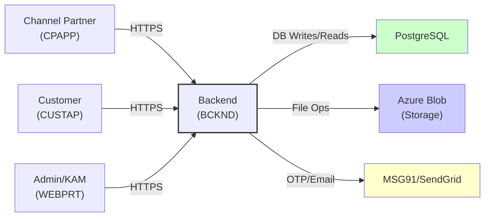
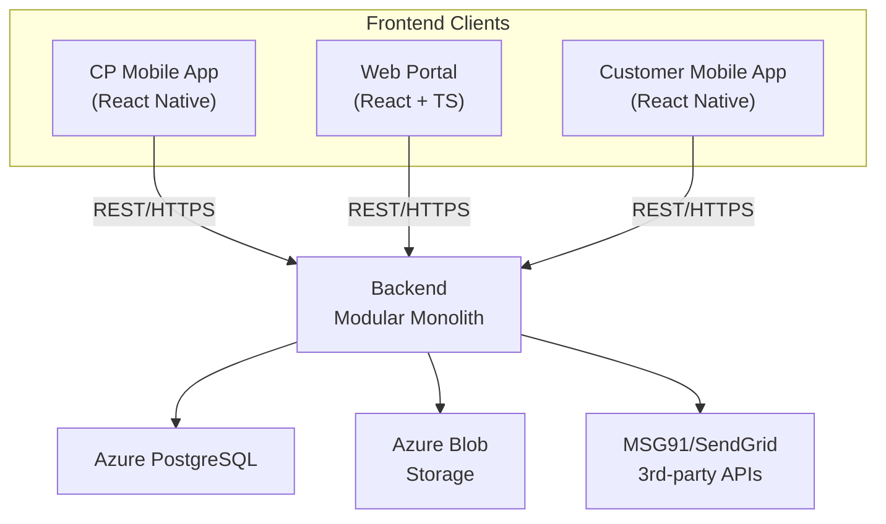
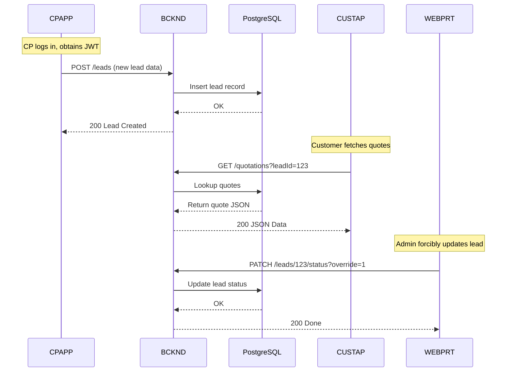
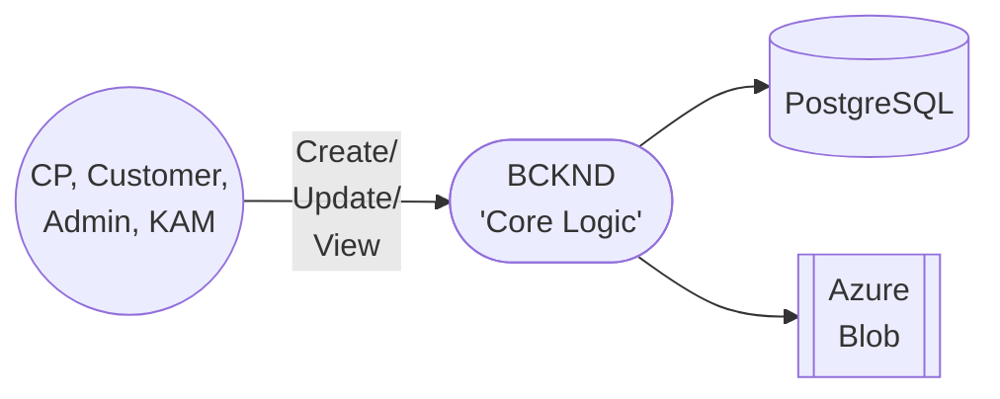
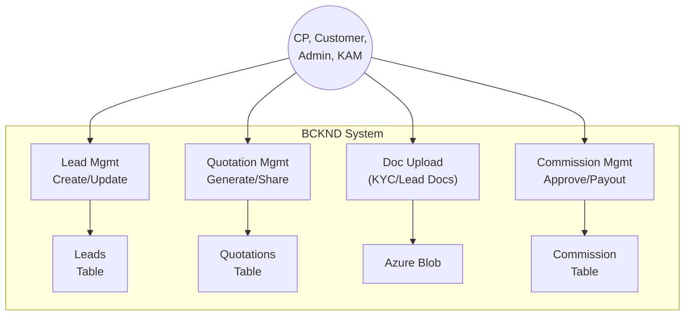
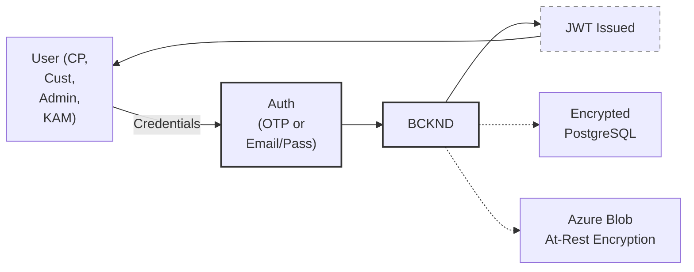
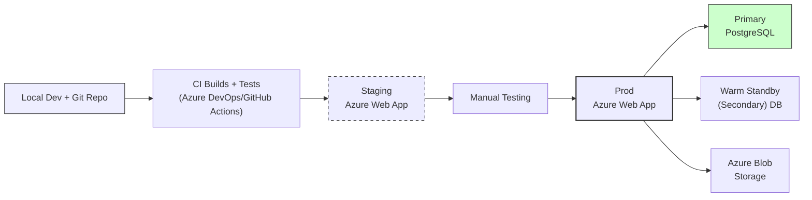

## L1-HLD: High-Level Design (HLD) Document

This document presents a high-level view of the Solarium Green Energy solution’s overall architecture, highlighting major system components, their interactions, and the core technical decisions guiding the design. It reflects the current project scale of approximately 400–600 concurrent users, prioritizing a pragmatic, modular monolith approach with reasonable extensibility for future growth without introducing unnecessary complexity.

---

## Architecture Overview

The Solarium system provides an end-to-end platform for solar product sales and installation requests. Four main components collaborate:

1. Channel Partner Mobile App (CPAPP) – for Channel Partners to manage leads, generate quotations, and track commissions.  
2. Customer Mobile App (CUSTAP) – for end customers to submit service requests, review quotes, upload KYC docs, and create support tickets after project execution.  
3. Web Portal (WEBPRT) – for Admins and Key Account Managers (KAM) to manage leads, quotations, Channel Partners, and commissions.  
4. Backend (BCKND) – a containerized “modular monolith” hosted in Azure, responsible for business logic, data persistence, role-based security, and integrations (SMS, email, file storage).

At a high level, CPAPP, CUSTAP, and WEBPRT all communicate with the BCKND over secure HTTPS, while the BCKND stores persistent data in Azure Database for PostgreSQL and uses Azure Blob for file management. External services like MSG91 (for SMS/OTP) and SendGrid (for email) integrate via APIs.

### Architecture Overview Diagram

In this diagram, the Backend (BCKND) is the central orchestrator, ensuring consistent data flows and enforcing role-based constraints (e.g., CP, KAM, Admin, Customer).

---

## System Components Descriptions

Below are the major software components, each focusing on a distinct domain yet collectively forming a cohesive solution:

### 1. CPAPP (Channel Partner App)
• Built in React Native (iOS/Android).  
• Allows CPs to register, manage leads, generate/share quotations, and view commissions.  
• Operates mainly in online mode, with read-only cached data available offline.

### 2. CUSTAP (Customer App)
• Built in React Native (iOS/Android).  
• Enables customers to request solar services, upload KYC documents, accept or reject quotations, and raise support tickets after projects are executed.  
• Retains a simple offline view for previously fetched data but requires online connectivity for new actions.

### 3. WEBPRT (Admin & KAM Portal)
• A React + TypeScript Single Page Application (SPA).  
• Admin role manages Channel Partners, users, master data, leads, commissions, KAM assignments, and has full override privileges.  
• KAM role provides territory-limited lead oversight, KYC approvals, partial lead reassignments, and quotation generation.

### 4. BCKND (Backend)
• A single “modular monolith” application in Node.js or a similar stack, containerized on Azure Web App.  
• Provides RESTful APIs, business logic enforcement (lead status matrix, commissions), file management, and authentication/authorization.  
• Interacts with a Postgres database for structured data and Azure Blob for documents/PDFs.

### System Components Diagram

---

## Inter-Component Communication

All interactions happen through RESTful HTTP endpoints exposed by BCKND. Data is exchanged in JSON format, secured via TLS (HTTPS), with JWT-based authorization headers. Each frontend authenticates and obtains a token, included in subsequent calls.

### Key API Endpoints (High Level)
1. /auth/login (CP + Customer: OTP-based; Admin/KAM: email/password).  
2. /leads/… (CRUD leads, status updates, reassignments).  
3. /quotations/… (create, retrieve, share PDF links, handle acceptance).  
4. /documents/… (KYC uploads, lead doc uploads).  
5. /commissions/… (approve, mark as paid).  
6. /masterdata/… (Admin updates panels, inverters, fees, etc.).

### Inter-Component Communication Diagram

---

## Data Architecture Details

• PostgreSQL database holds structured data for leads, quotations, user records, commissions, etc.  
• Azure Blob hosts binary objects (KYC files, site photos, PDF quotations). Each record in Postgres references the file’s blob key.

### Data Flow Diagrams

#### Level 0 DFD

Data flows from each user role’s device to the BCKND. The BCKND either updates/fetches data from PostgreSQL or handles file operations in Azure Blob.

#### Level 1 DFD (Key Processes)

- Leads, Quotations, Doc Uploads, Commissions represent the main data processes.  
- Each references either PostgreSQL or Azure Blob, triggered by user actions.

---

## Integration Points Introduction

In addition to the core system components, Solarium integrates with several external services to provide specialized capabilities, such as sending SMS-based OTP, sending emails, and storing files. These integrations ensure that critical functions (e.g., user verification) and file management work reliably at our current scale of ~400–600 concurrent users.

## Integration Points

1. **MSG91 (SMS/OTP)**  
   – BCKND calls MSG91 to send OTP for CP/Customer phone-based logins.  
2. **SendGrid (Email)**  
   – Used for Admin or KAM password resets and possibly system notifications.  
3. **Azure Services**  
   – Azure Blob: file storage for uploaded documents and generated PDFs.  
   – Azure Database for PostgreSQL: relational storage for all business data.  

No advanced real-time push notifications are implemented; the system relies on polling or manual sync by clients to detect updates. Any references to “push notifications” in the solution documents indicate “in-app alerts triggered upon sync” rather than a true server-initiated push channel.

---

## Constraints and Assumptions Introduction

The following statements define the solution’s boundaries and operational considerations based on the current scale (approximately 400–600 concurrent users). They guide implementation choices and clarify where certain capabilities (e.g., offline writes or advanced conflict resolutions) are intentionally limited to keep the design pragmatic and maintainable.

## Constraints and Assumptions

1. **Concurrency Model**: We use a last-write-wins approach to handle concurrent edits, tracking overwrites in an audit timeline. However, updates to certain critical fields (e.g., commission finalization, pricing overrides) are restricted by role-based permissions or manual checks to prevent unintended overwrites.  
2. **Offline Limitations**: CPAPP and CUSTAP display offline data read-only. No offline creation or update is supported to uphold data integrity at the current scale.  
3.  Notification Strategy: We do not provide actual real-time push. Instead, we rely on periodic or manual sync to retrieve updated data, supplemented by SMS for OTP and certain major alerts (like registration approval). References to “push” in older workflow docs are effectively poll-based in-app notifications.  
4. **DR Strategy**: We maintain daily backups in the primary region. An optional minimal read replica in a secondary region can be introduced if usage or SLA requirements justify it, ensuring a faster manual failover if needed.  
5. **7-Year Retention**: Documents are stored for a targeted seven-year retention, with no automated purge enforced yet. Additionally, lead-level documents are capped at 7 attachments per lead to control storage costs and complexity.  
6.   
   Lead Status Flow: We maintain a separate “Customer Accepted” status once the customer approves a quotation. The lead transitions to “Customer Accepted” before the CP or Admin finalizes it as “Won.” This ensures better reporting granularity and clarity in the sales funnel.  
7. Sync Approach: Only full data refreshes are performed when syncing. No partial “delta pull” is currently supported, despite any references to delta-based updates in earlier documents.

Within these constraints, the architecture remains suitable for the present load (up to 600 concurrent users) and balanced in complexity vs. performance.

---

## Technology Choices

We have selected and combined our technology stack to efficiently serve approximately 400–600 concurrent users, ensuring stable performance while keeping the solution straightforward to maintain. These choices align with the solution’s needs for role-based security, minimal offline capabilities, and moderate data volumes. Below is a breakdown of our main technology decisions:

• **Frontend**:  
  – React Native for CPAPP/CUSTAP ensures cross-platform apps.  
  – React + TypeScript SPA for WEBPRT enables a modern web experience.

• **Backend**:  
  – Node.js or similar runtime for the “modular monolith” approach.  
  – Containerized deployment on Azure Web App for simple scaling.

• **Database & File Storage**:  
  – Azure Database for PostgreSQL (Flexible Server) for structured data.  
  – Azure Blob for unstructured documents and images.

• **Communication**:  
  – RESTful APIs over HTTPS, JSON data exchange.  
  – JWT-based user authentication, short-lived tokens for secure calls (auto-refreshed for around 24 hours; user inactivity triggers logout at the configured time frames).

• **Disaster Recovery**:  
  – Single primary region with nightly backups.  
  – Optionally, a minimal read replica or warm standby in a secondary region can be introduced later if required by business growth or SLA demands.

---

## Security Architecture Overview

Our security emphasizes role-based access, token validation, and data encryption at rest. We ensure regulated data handling for KYC documents.

1. **Authentication** via phone+OTP (CP, Customer) or email+password (Admin/KAM). BCKND issues short-lived JWT tokens.  
2. **Authorization** enforced by checking user roles on each API route (CP, KAM, Admin, Customer). Critical financial or lead-pricing fields also require appropriate roles to update, preventing accidental or unauthorized overwrites.  
3. **Data Protection**:  
   – PostgreSQL and Azure Blob both have encryption at rest using AES-256.  
   – All network calls are over TLS 1.2+.  
4. **Compliance**: A 7-year data retention for KYC/lead docs is targeted, though no automated purge currently runs.

### Security Architecture Overview Diagram

When a user logs in, the BCKND issues a JWT upon successful credential validation. All subsequent requests must include the token in HTTP headers.

---

## Deployment Architecture

We utilize Azure for hosting and container orchestration. Code is stored in a Git repository with CI/CD pipelines for automated building, testing, and deployment to staging/production.

1. **Environments**:  
   – Development/QA environment (staging) for testing.  
   – Production environment in a primary Azure region, with optional read replica or warm standby if future usage or SLA needs justify it.

2. **CI/CD Process**:  
   – Git push triggers pipelines in Azure DevOps or GitHub Actions.  
   – Automated build + test steps run.  
   – Successful builds deploy containers to staging.  
   – Manual approval promotes from staging to production.

### Deployment Architecture Diagram

---

## End of Document