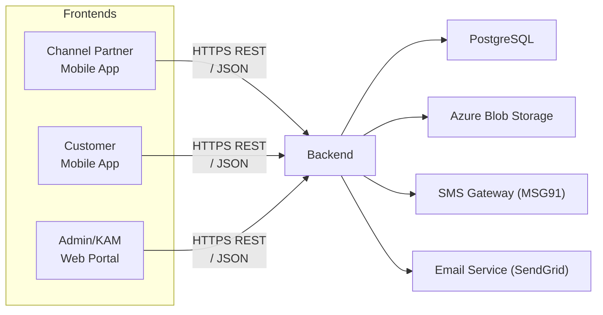
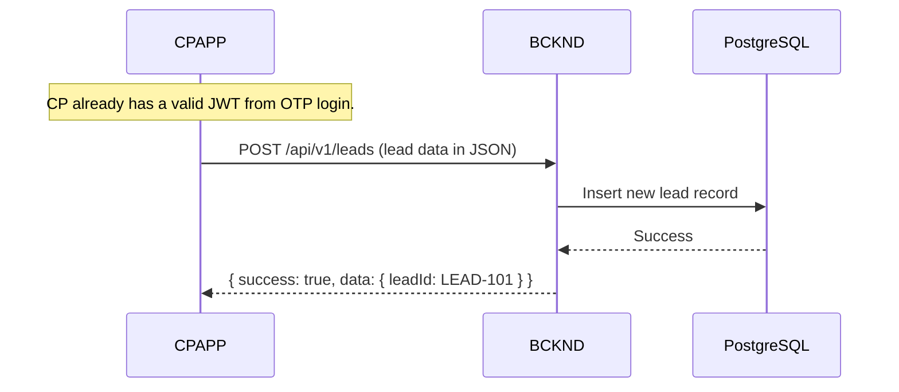
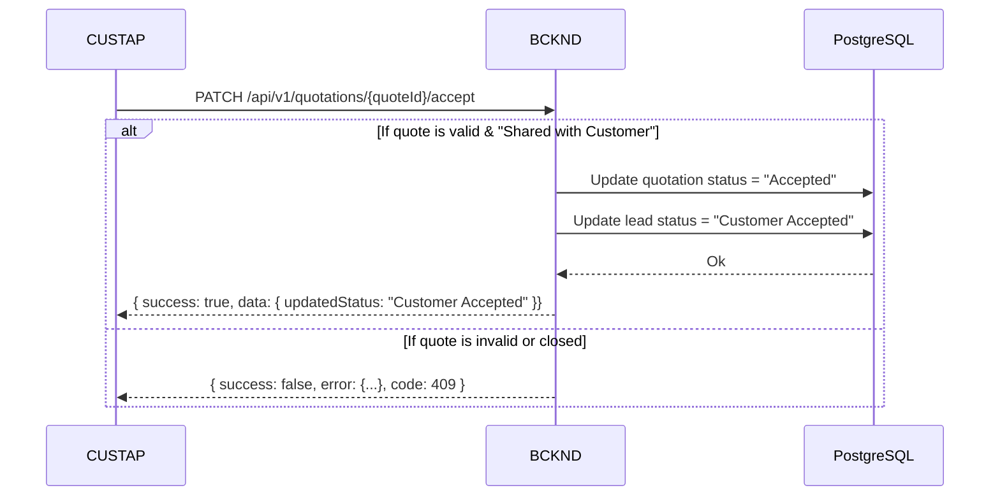
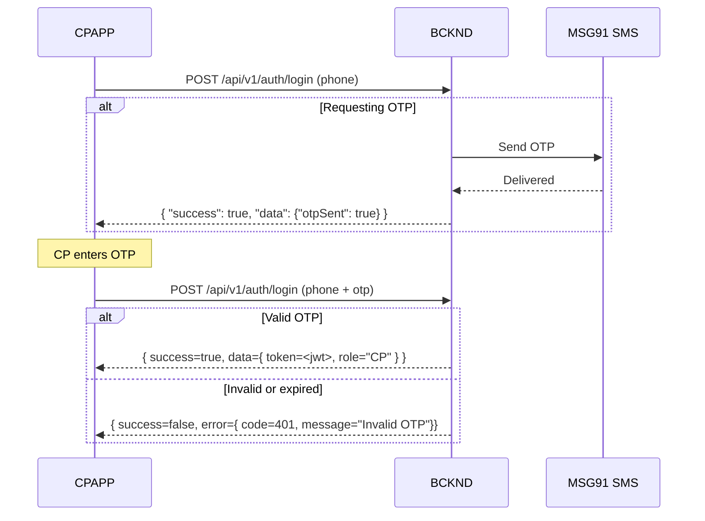
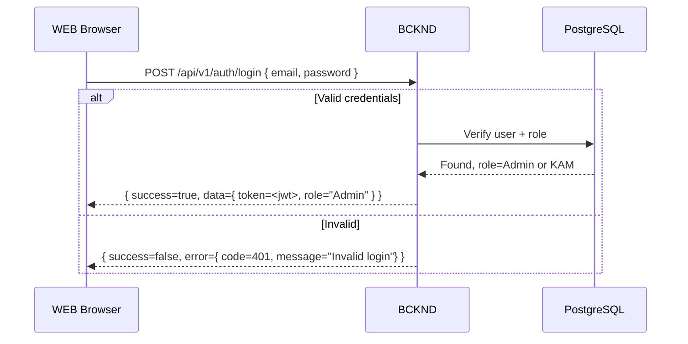

``
## L2-LLD-IC: Inter-Component Interaction Design Document

This document describes how the four main components of the Solarium Green Energy solution (CPAPP, CUSTAP, WEBPRT, and BCKND) communicate with one another. It focuses on the structure and patterns of inter-component API calls, authentication flows, data synchronization strategies, and related cross-cutting concerns. Internal design details of each component reside in separate L3 documents.

---

## Table of Contents
1. [Overview](#overview)  
2. [Inter-Component Communication Patterns](#inter-component-communication-patterns)  
   - [General Interaction Flow Diagram](#general-interaction-flow-diagram)  
   - [Sample Sequence Diagram: Lead Creation (CP)](#sample-sequence-diagram-lead-creation-cp)  
   - [Sample Sequence Diagram: Customer Quotation Acceptance](#sample-sequence-diagram-customer-quotation-acceptance)  
3. [API Endpoint Specifications](#api-endpoint-specifications)  
   - [Base Path & Versioning](#base-path--versioning)  
   - [Standard Request/Response Format](#standard-requestresponse-format)  
   - [Example Endpoints](#example-endpoints)  
   - [Pagination & Filtering](#pagination--filtering)  
   - [File Upload & Retrieval Process](#file-upload--retrieval-process)  
4. [Database Synchronization Strategies](#database-synchronization-strategies)  
5. [Cross-Component Authentication Flow](#cross-component-authentication-flow)  
   - [Sequence Diagram: CP OTP Login](#sequence-diagram-cp-otp-login)  
   - [Sequence Diagram: Admin/KAM Login](#sequence-diagram-adminkam-login)  
6. [Role-Based Access Control (RBAC)](#role-based-access-control-rbac)  
7. [Data Encryption Standards Across Components](#data-encryption-standards-across-components)  
8. [Code Organization Across Components](#code-organization-across-components)

---

## 1. Overview

The Solarium Green Energy system comprises four major components that operate together through REST APIs and secure file storage patterns:

1. Channel Partner App (CPAPP) – React Native mobile app for CPs to manage leads, generate quotations, and view commissions.  
2. Customer App (CUSTAP) – React Native mobile app for customers to request services, accept/reject quotations, and upload KYC documents.  
3. Web Portal (WEBPRT) – React + TypeScript SPA for both Admin and KAM roles, providing lead oversight, user management, commission approvals, and more.  
4. Backend (BCKND) – A containerized Node.js “modular monolith” applying business rules, persisting data to PostgreSQL, and storing documents in Azure Blob via short-lived SAS tokens.

This document details how these components communicate with each other at an integration (L2) level, emphasizing REST endpoint design, authentication flows, and cross-cutting concerns (e.g., concurrency strategies, error handling).

---

## 2. Inter-Component Communication Patterns

All component-to-component communication takes place between each front-end client (CPAPP, CUSTAP, WEBPRT) and the BCKND via HTTPS REST calls. Each frontend uses the responses to present or update domain data.

### General Interaction Flow Diagram

Below is a simplified representation of the main communication channels:



- CPAPP and CUSTAP primarily use OTP-based login flows.  
- WEBPRT (Admin/KAM) uses email/password.  
- Documents are stored in Azure Blob, which is accessed via short-lived SAS tokens granted by the BCKND.

### Sample Sequence Diagram: Lead Creation (CP)

Below is a typical flow of a Channel Partner creating a new lead from the CPAPP:



1. CPAPP includes the JWT in the Authorization header (“Bearer <token>”).  
2. BCKND creates the record in PostgreSQL (auto-increment ID + “LEAD-xxx” prefix).  
3. Returns success with the newly created lead ID for reference.

### Sample Sequence Diagram: Customer Quotation Acceptance

When a customer accepts a shared quotation through the CUSTAP:



1. The Customer app calls PATCH with the accepted quotation ID.  
2. BCKND enforces rules (only one accepted quotation—others become “Rejected”).  
3. Lead transitions to “Customer Accepted,” pending CP or Admin to finalize as “Won.”

---

## 3. API Endpoint Specifications

This section highlights key design decisions for the overall cross-component API.

### Base Path & Versioning

• All HTTP endpoints use a versioned base path:  
  ```
  /api/v1/...
  ```  
• Example: /api/v1/leads, /api/v1/quotations, /api/v1/auth/login

### Standard Request/Response Format

• Responses follow a uniform JSON envelope:  
  ```json
  {
    "success": true,
    "data": { ... },
    "error": null
  }
  ```
  or for an error:
  ```json
  {
    "success": false,
    "data": null,
    "error": {
      "code": 409,
      "message": "Quotation already accepted by another user"
    }
  }
  ```

• HTTP status codes:  
  - 200/201 for success  
  - 400 for invalid input (e.g., missing fields)  
  - 401 for unauthorized (missing/invalid token)  
  - 403 for forbidden (role mismatch)  
  - 409 for concurrency or state conflicts (e.g. lead is locked, or quote has been accepted)  
  - 500 for internal server errors  

### Example Endpoints

Below is a concise overview of several key endpoints relevant to inter-component interactions.

1. **Auth**  
   - POST /api/v1/auth/login  
     - CP/Customer: Body: { phone: "1234567890", otp: "xxxxxx" }  
     - Admin/KAM: Body: { email: "admin@domain.com", password: "xyz" }  
     - Response: { success, data: { token, role }, error }  

2. **Leads**  
   - GET /api/v1/leads?offset=0&limit=25&status=In Discussion  
   - POST /api/v1/leads (creates lead)  
   - PATCH /api/v1/leads/{leadId}/status (updates lead status)  

3. **Quotations**  
   - POST /api/v1/quotations (generate new)  
   - PATCH /api/v1/quotations/{quoteId}/share  
   - PATCH /api/v1/quotations/{quoteId}/accept  
   - GET /api/v1/quotations?offset=0&limit=25&leadId=LEAD-101  

4. **Documents**  
   - POST /api/v1/kycDocuments (upload KYC doc)  
   - POST /api/v1/leadDocuments (upload lead doc)  
   - GET /api/v1/documents/sas?docId=someId (obtain short-lived SAS URL)  

### Pagination & Filtering

• Large list endpoints (e.g., leads, quotations) accept offset, limit, optional status fields, and sorting parameters.  
• Example:  
  ```
  GET /api/v1/leads?offset=50&limit=25&status=In%20Discussion
  ```
• “Endless scroll” on CPAPP is implemented by incrementally increasing the offset.

### File Upload & Retrieval Process

• Two separate endpoints for KYC vs. lead documents:
  - /api/v1/kycDocuments  
  - /api/v1/leadDocuments

• For each file operation:  
  1. Client calls an upload endpoint with metadata (docType, leadId or customerId).  
  2. BCKND checks user role/ownership, generates a short-lived SAS token if valid.  
  3. Client then PUTs the file directly to Azure Blob using the SAS URL.  

• Downloading a doc requires a GET /api/v1/documents/sas?docId=xxx call to obtain a short-lived read-only URL.

---

## 4. Database Synchronization Strategies

- **Real-Time Updates**: CPAPP and CUSTAP must be online to create or update records. The Web Portal is also fully online.  
- **No Offline Writes**: If a CP (or Customer) is offline, only read access to cached data is available in the app.  
- **Last-Write-Wins**: For concurrency, the BCKND does not maintain row-level version checks. If two updates collide, the latest valid write is accepted. If a critical conflict arises, the BCKND may return 409 (Conflict).  
- **Manual Retry**: If conflict or partial failure occurs, each client side must prompt a manual retry.

---

## 5. Cross-Component Authentication Flow

Clients (CPAPP, CUSTAP, WEBPRT) authenticate via BCKND. No dedicated refresh token endpoint is offered; re-login is required upon token expiry.

### Sequence Diagram: CP OTP Login



- OTP attempts are limited (e.g., 5 tries) with a 15-minute lockout after exceeding attempts.  
- CP obtains a JWT with role="CP" upon valid login.

### Sequence Diagram: Admin/KAM Login



- A 30-minute inactivity window logs out Admin/KAM.  
- No token refresh route; user re-enters credentials as needed.

---

## 6. Role-Based Access Control (RBAC)

- **Roles**: CP, Customer, KAM, Admin. The JWT includes a basic role claim:  
  ```
  {
    "sub": "user_id",
    "role": "Admin",
    "iat": 1670000000,
    "exp": 1670003600
  }
  ```
- **Backend Enforcement**: Each endpoint checks the role and denies access (403) if insufficient privileges.  
- **Examples**:  
  - /api/v1/commissions requires Admin role to mark “Paid.”  
  - /api/v1/leads/{id}/reassign requires Admin or KAM.  
  - /api/v1/leadDocuments?leadId=xxx requires the lead’s assigned CP or Admin/KAM in that territory.

---

## 7. Data Encryption Standards Across Components

1. **Transport Security**: All requests use TLS 1.2+ to the /api/v1 endpoints.  
2. **JWT**: CP/Customer store tokens in standard mobile app storage (AsyncStorage) to simplify development—accepted risk is mitigated by short token expiry or forced re-login.  
3. **Azure Blob Access**:  
   - Short-lived (~5 min) SAS tokens are used for direct upload/download.  
   - BCKND checks doc ownership before generating a SAS token.  
4. **Database Encryption**: Azure Disk-level encryption for PostgreSQL, no extra overhead for clients.  

---

## 8. Code Organization Across Components

- **Backend**  
  - Modular monolith in Node.js (TypeScript).  
  - Organized by feature modules (auth, leads, quotations, documents).  
  - Single repository for the BCKND.  
- **CPAPP & CUSTAP**  
  - Separate React Native projects. Each interacts with the BCKND via REST calls.  
  - Uses shared utility services for authentication, API calls, JSON parsing.  
- **WEBPRT**  
  - React + TypeScript SPA.  
  - Dedicated repository or sub-folder in the same monorepo, depending on build pipeline needs.  
  - Communicates with BCKND using standardized services and typed HTTP client code.  

Throughout all components, the integration approach remains consistent:
- Use standard endpoints under /api/v1.  
- Enforce uniform JSON responses.  
- Follow common error codes (400, 401, 403, 409, 500).  
- Rely on short-lived SAS tokens for file operations.  
- Rely on last-write-wins concurrency with optional manual resolution by Admin or KAM in complex conflicts.

---

**End of L2-LLD-IC Document**  
```
