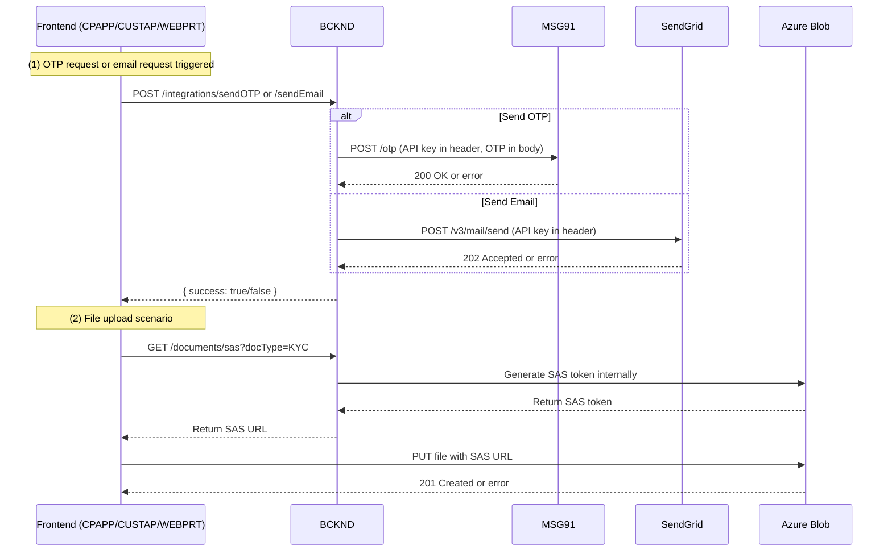
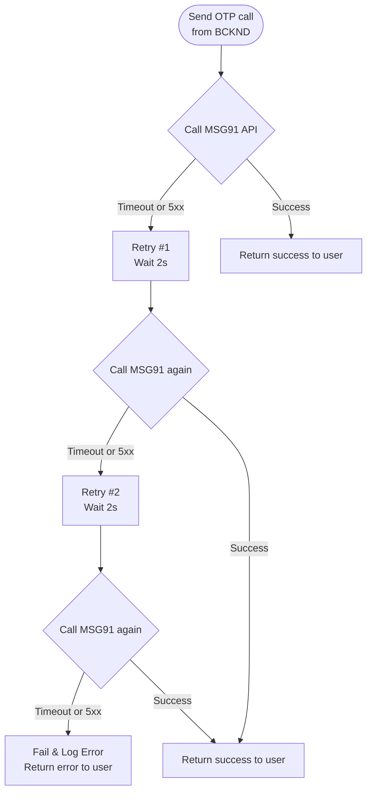

`
## L2-LLD-INTG3P: Integration with Third-Party Services Document

This document describes how the Solarium Green Energy solution integrates with external (third-party) services at the cross-cutting level. It details the overall interaction design, authentication methods, data transformations, error handling strategies, and relevant flow diagrams for each integration. Component-level (L3) documents will further expand on implementation details within each component (CPAPP, CUSTAP, WEBPRT, or BCKND).

---

## Table of Contents
1. [Introduction](#introduction)  
2. [External Service Interfaces](#external-service-interfaces)  
   - [API Integrations](#api-integrations)  
   - [Authentication Methods](#authentication-methods)  
   - [Data Transformation](#data-transformation)  
3. [Error Handling for External Services](#error-handling-for-external-services)  
   - [Timeout & Retry Policies](#timeout--retry-policies)  
   - [Fallback Mechanisms](#fallback-mechanisms)  
   - [Notification Systems](#notification-systems)  
4. [External Service Interaction Diagrams](#external-service-interaction-diagrams)  
5. [Error Handling Flow Diagrams](#error-handling-flow-diagrams)  
6. [Additional Remarks](#additional-remarks)

---

## 1. Introduction
The Solarium Green Energy solution relies on key third-party services for critical functionalities, focusing on:
1. SMS-based OTP delivery (MSG91).  
2. Transactional email dispatch (SendGrid).  
3. Secure file storage for documents (Azure Blob Storage).  

All integrations must accommodate ~400–600 concurrent users under normal peak loads. Each service uses a straightforward, role-based security or API-key approach. This document outlines how these services are invoked, how data is transformed, and how the system handles errors, timeouts, or failures when interfacing with these external endpoints.

---

## 2. External Service Interfaces

### API Integrations
The system integrates with the following external APIs:

1. **MSG91 (SMS/OTP)**  
   - Purpose: Delivers OTP messages to Channel Partners and Customers for login.  
   - Contract: The backend (BCKND) generates a 6-digit OTP in-house, stores/validates it, and calls MSG91 to send an SMS.  
   - Key Endpoints (e.g., MSG91 SendOTP or Transactional):  
     - The system requests SMS via an HTTP POST with the user’s phone, template ID, and the dynamically generated OTP string.

2. **SendGrid (Email)**  
   - Purpose: Sends password reset emails to Admin/KAM and certain system notifications.  
   - Contract: The backend calls SendGrid’s REST endpoint with a JSON payload containing subject, recipient, and message body (or template ID).

3. **Azure Blob Storage**  
   - Purpose: Stores KYC files, lead documents, and generated PDF quotations.  
   - Contract: Direct upload and download by clients (CPAPP, CUSTAP, WEBPRT) using short-lived SAS URLs (~30 minutes).  
   - Container structure is typically “docs/<env>/<year>/<month>”. No IP restriction is currently applied to simplify upload from any client location.

### Authentication Methods
1. **API Key / Bearer Token**  
   - MSG91 and SendGrid require an API key or token in the HTTP Authorization header.  
   - These keys are stored securely in the BCKND’s environment variables (not exposed to front-end).  

2. **SAS Tokens (Azure Blob)**  
   - For each file upload/download, the backend verifies user permissions and then generates a short-lived (about 30 minutes) SAS token.  
   - Clients (CPAPP, CUSTAP, WEBPRT) use this SAS token to PUT/GET the file directly from Azure Blob.

### Data Transformation
1. **OTP Payload**  
   - BCKND formats a short textual template: “Your One-Time Password (OTP) is 123456. Valid for 2 minutes.”  
   - This merges the dynamically generated OTP with an approved template ID for DLT compliance (if applicable).

2. **Email Templates**  
   - Minimal placeholder transformations (username, reset link) performed in BCKND.  
   - SendGrid receives final text or templated fields to handle.  

3. **File Metadata**  
   - On BCKND, each file is tagged with doc type, reference ID, and assigned path (e.g., “docs/prod/2023/09”).  
   - The client only needs the final SAS URL; no further data transformation is required on the client side.

---

## 3. Error Handling for External Services

### Timeout & Retry Policies
1. **Request Timeouts**  
   - Each external call (SMS, email, or blob SAS issuance) is set with a ~3–5 second timeout.  
   - If the service does not respond, the BCKND fails the request and logs the event.

2. **Retry Strategy**  
   - A simple “2-retry model” is used for MSG91 and SendGrid if we receive a 5xx or timeout.  
   - Each retry waits ~1–2 seconds before resending. If both retries fail, the function returns an error to the front-end consumer.

3. **File Upload/Download Failures**  
   - If Azure Blob is unreachable or the SAS token generation fails, the system logs an error, and the user is prompted to retry after short intervals.  
   - The BCKND does not attempt multi-step fallback (e.g., storing to a different provider). Instead, the user can manually retry once the service is stable.

### Fallback Mechanisms
1. **No Alternate SMS Provider**  
   - Currently, we do not implement an automatic fallback to another SMS gateway if MSG91 is down.  
   - Users must retry later if we detect consistent failures or timeouts from MSG91.

2. **Email**  
   - No second email provider is configured; Admin will be notified if repeated attempts fail.  
   - In a production incident, operations staff can switch to a new API key or alternative vendor in an emergency, but this is a manual process.

3. **Blob Storage**  
   - No direct fallback; we rely on Azure’s reliability. If an outage occurs, document uploads are temporarily unavailable.

### Notification Systems
1. **System Logs & Alerts**  
   - All external-service failures are logged in the BCKND.  
   - Optional: Azure Monitor or Application Insights can push an alert to the ops team if failures spike above a threshold (e.g., 10 failures/minute).  

2. **User-Facing Messages**  
   - CPAPP or CUSTAP will display short error prompts (e.g., “Unable to send OTP. Please try again.”).  
   - The WEBPRT interface may show alert banners if email dispatch fails.

---

## 4. External Service Interaction Diagrams

Below is a high-level sequence diagram illustrating how Solarium integrates with MSG91 (as an example), SendGrid, and Azure Blob. Each call is triggered by the BCKND upon user request, with the BCKND performing API authentication and controlling data flow.



**Key Points**  
- The backend (BK) is the gatekeeper for external calls.  
- MSG91 (SMS) or SendGrid (email) require an API key in the Authorization header.  
- Azure Blob’s SAS token is short-lived, letting the frontend handle direct PUT/GET operations for file storage.

---

## 5. Error Handling Flow Diagrams

When external services fail, the system follows a short decision and retry flow. The diagram below focuses on SMS as an example, but email follows a similar approach.



**Explanation**  
1. The first attempt is made to MSG91 with a short (3–5s) timeout.  
2. On failure, we do up to two brief retries.  
3. If all fail, the BCKND logs the error and sends a failure response to the user.  

Similar logic is applied for email (SendGrid). For Azure Blob, the user is advised to retry the upload if SAS token issuance or the actual file PUT is unsuccessful.

---

## 6. Additional Remarks
1. **Scalability**: The chosen approach of short timeouts and minimal retry ensures we can handle normal concurrency (~400–600) without saturating external service APIs.  
2. **Compliance**:  
   - OTP templates are pre-registered with MSG91 if operating in DLT-regulated regions.  
   - Only a single “transactional” or “OTP” template is used, simplifying template management.  
3. **Future Enhancements**:  
   - We may add a fallback SMS provider if reliability issues arise.  
   - We can enable Azure Blob soft-delete or versioning if regulatory requirements expand.  
   - Additional monitoring or circuit-breaker patterns may be introduced if usage scales beyond current peaks.

This completes the L2-LLD-INTG3P document, clarifying the third-party integration design, successes, and failure handling. Each component-level L3 document will incorporate these guidelines to manage actual function calls, environment variables, and edge cases within the respective codebases.
```
