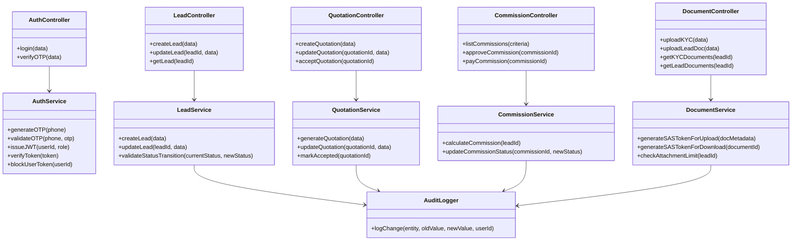
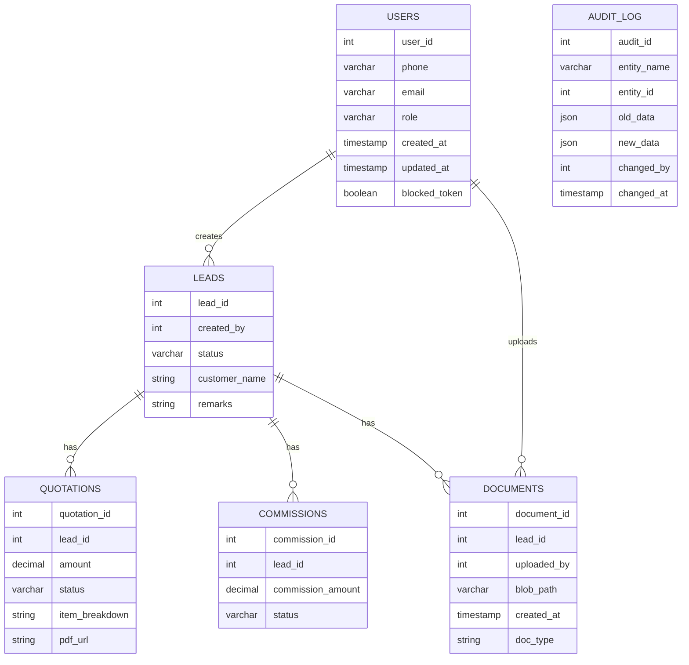
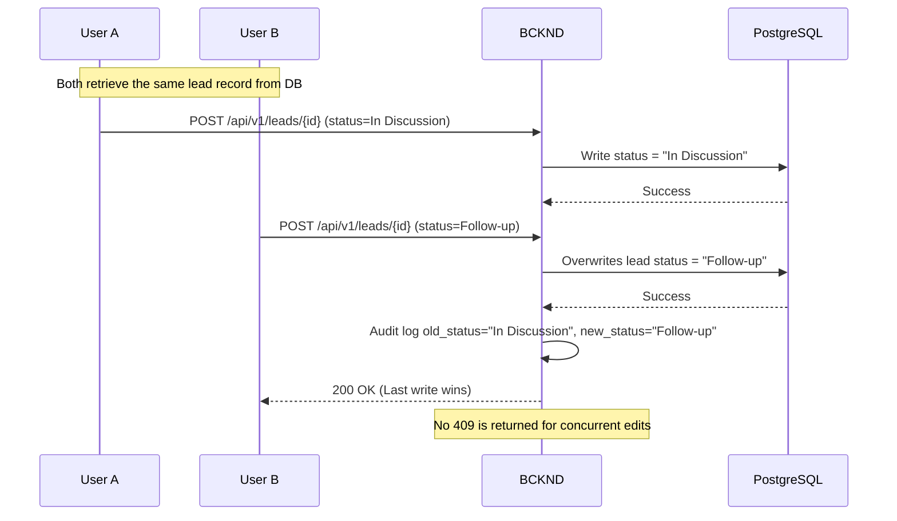
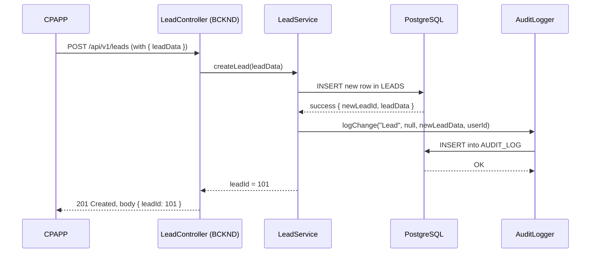
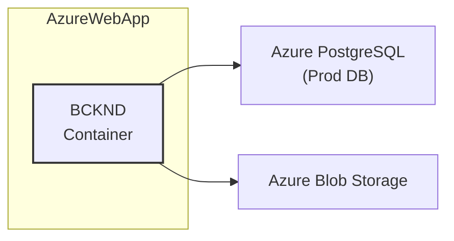
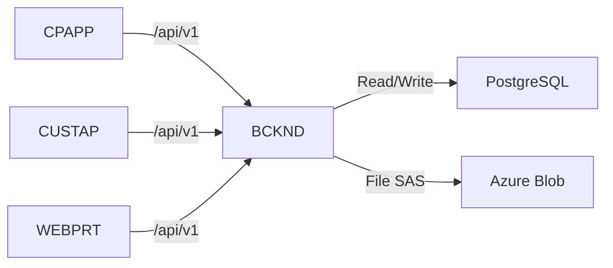
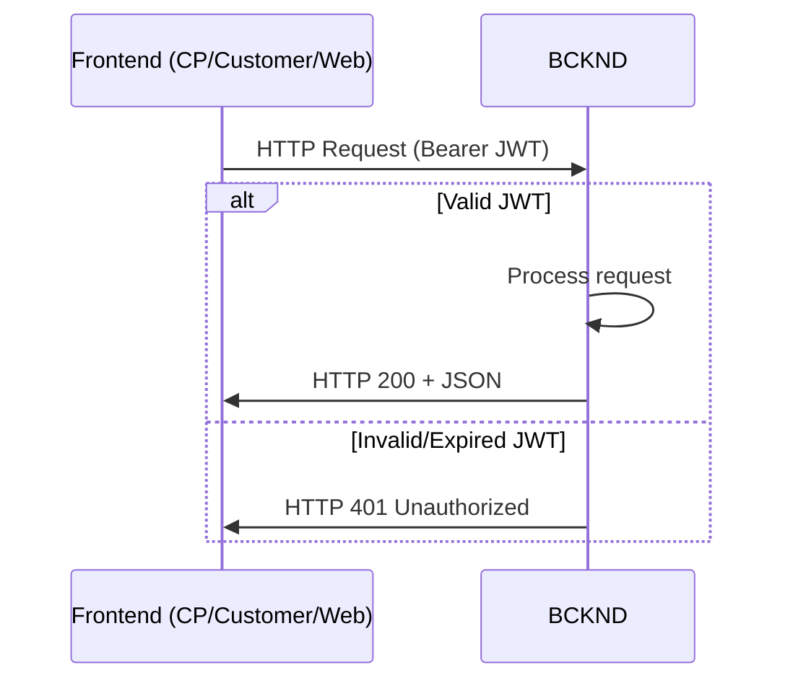
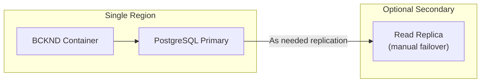

Below is the complete L3-LLD-BCKND document with revisions to address the noted contradictions and clarify the solution’s scope. 

<delete>## L3-LLD-BCKND: Component-Specific Low-Level Design Document for BCKND (Revised)</delete>
<add>## L3-LLD-BCKND: Component-Specific Low-Level Design Document for BCKND Document</add>

### 1. Introduction
This document provides a comprehensive, low-level design (LLD) for the Backend (BCKND) component of the Solarium Green Energy solution. It adapts the high-level architectural decisions from L1-HLD and inter-component communication patterns from L2-LLD-IC to guide the technical implementation of BCKND. Core clarifications from the client (on database schema, concurrency handling, commission calculation, token lifetimes, and audit log strategy) are reflected to ensure a pragmatic approach at the ~400–600 concurrent user scale.

<delete>Note: This version is revised to align with a pure “last-write-wins” concurrency model (no row-level version checks), short-lived JWT tokens (~1–2 hours) without an auto-refresh mechanism, and to remove partial commission payouts. Document upload endpoints are also unified with L2 references, and the mandatory 7-attachment-per-lead limit is enforced by the backend. Additionally, a stricter phone-number uniqueness is introduced in the database schema. All changes are marked with &lt;add&gt;, &lt;delete&gt;, or &lt;edit&gt; tags.</delete>

<add>Note: This version is revised to align with a pure “last-write-wins” concurrency model (no row-level version checks), short-lived (~2 hours) JWT tokens with an auto-refresh mechanism (renewable up to ~24 hours for continuous usage), and to remove partial commission payouts. Document upload endpoints are also unified with L2 references, and a revised 7-attachment-per-lead limit applies only to lead-related docs (excluding KYC). Additionally, phone-number uniqueness is now enforced only for customers (role = 'Customer'). All changes are marked with &lt;add&gt;, &lt;delete&gt;, or &lt;edit&gt; tags.</add>

---

### 2. Component Context
The BCKND is a “modular monolith” Node.js application deployed as a containerized service on Azure. It handles all business logic, data persistence, and external integrations for the system.

- Acts as the central orchestrator for:
  - Lead Management and Quotation workflows used by Channel Partner (CP) and Customer applications.
  - Admin/KAM functionalities via the Web Portal (WEBPRT).
- Stores structured data in Azure Database for PostgreSQL.
- Manages file uploads (KYC, site photos, quotation PDFs) in Azure Blob via short-lived SAS tokens.
- Integrates with third-party services for SMS (MSG91) and email (SendGrid).

<add>Note: BCKND does not implement real-time server push notifications. All notifications or data refresh events rely on polling or manual sync calls, consistent with L1-HLD.</add>

#### Interaction Points
From L2-LLD-IC, all front-end clients (CPAPP, CUSTAP, WEBPRT) communicate with BCKND over REST/HTTPS, exchanging JSON payloads. BCKND:
1. Validates security (JWT-based) and role-based permissions.  
2. Executes domain logic (e.g., verifying lead status transitions), applying a last-write-wins model for collisions and logging overwrites.  
3. Persists changes in PostgreSQL and logs overwrites or updates in an audit table.  
4. Issues short-lived SAS tokens for direct file blob operations.

---

### 3. Detailed Design

#### 3.1 Module Descriptions
The BCKND is structured into discrete modules that align with domain operations. Each module is implemented in TypeScript (or JavaScript with TypeScript definitions) within a single codebase, enabling clear separation of concerns:

1. **Auth Module**  
   - Manages user identity and roles (CP, Customer, KAM, Admin).  
   - Handles OTP-based login (CP/Customer) and email/password login (Admin/KAM).  
   <delete>- Issues short-lived JWT tokens (~1–2 hours) and verifies them on subsequent requests.</delete>
   <add>- Issues short-lived JWT tokens (about 2 hours) with an auto-refresh mechanism for up to ~24 hours of continuous activity, and verifies them on subsequent requests.</add>
   - Provides a mechanism for forced token invalidation (e.g., setting a “blocked” flag on the user record). Each request checks this flag before granting access.

2. **Lead Module**  
   - Core for creating and managing leads.  
   - Enforces lead status flow, including the “Customer Accepted” status, before finalizing leads as “Won.”  
   - Applies a last-write-wins approach for simultaneous updates, logging overwrites in the audit trail.

3. **Quotation Module**  
   - Generates quotations tied to leads.  
   - Updates statuses (e.g., “Draft,” “Shared,” “Accepted”).  
   - Integrates with a Bill of Materials or product catalog for cost calculations.

4. **Commission Module**  
   - Tracks commission records referencing leads/quotations.  
   - Operates only with single approval → single payout flows, consistent with L1-HLD & L2-LLD-IC.  
   - Exposes endpoints to mark commissions “Pending,” “Approved,” and “Paid.”
   <add>- In cases where a lead is reassigned mid-process, the original CP’s commission may be locked or manually adjusted by an Admin, as partial payouts are not implemented.</add>

5. **Document (File) Module**  
   <delete>- Enforces a maximum of seven total attachments per lead. If the limit is reached, the upload request is refused.</delete>
   <add>- Enforces a maximum of seven attachments for lead-related documents (excluding KYC). If the lead-document limit is reached, the upload request is refused; KYC uploads remain unaffected by this limit.</add>
   - Validates user/role ownership prior to generating short-lived SAS tokens.  
   - Persists references in the database, respecting the 7-year retention policy.

6. **Audit Logging Module**  
   - Inserts records into a shared `AUDIT_LOG` table whenever an entity update occurs.  
   - Stores the “before” snapshot in JSON, the new values, and the responsible user/timestamp.  
   - Acts as a centralized history record for overwritten data.

7. **Integration Module**  
   - Manages external calls to MSG91 (OTP) and SendGrid (email).  
   - Handles token-based authentication or secrets management for these third-party services.  
   - Abstracts external libraries to avoid scattershot usage across modules.  
   <add>- For deeper technical details on third-party integration specifics, refer to L2-LLD-INTG3P as per project guidelines.</add>

<add>8. **MasterData Module (Planned)**  
   - Will provide endpoints for managing products (panels, inverters, fees).  
   - The L2-LLD-IC references /masterdata endpoints under Admin privileges. This L3 document does not detail them extensively, but they may follow similar patterns for create/update operations.</add>

---

#### 3.2 Class Diagrams
Below is a simplified UML class diagram (Mermaid) illustrating core classes and relationships within the BCKND. Services coordinate domain logic; controllers parse HTTP requests, invoke services, and build responses. Repositories abstract DB queries.



---

#### 3.3 Database Schema
The BCKND primarily interacts with a PostgreSQL database. Tables are structured to handle leads, quotations, commissions, documents, users, and an audit log. Below is a high-level ER diagram in Mermaid. The system supports last-write-wins concurrency without row-level version checks, relying on audit logging to track overwrites.



**Key Points/Edits:**  
<delete>- `phone` in `USERS` is now enforced as UNIQUE to maintain 1:1 mapping between phone number and customer record.</delete>  
<add>- `phone` in `USERS` is enforced as UNIQUE only for role = 'Customer'. Non-customer roles (CP, Admin, KAM) may share a phone number if needed.</add>  
- `blocked_token` indicates whether the user is forcibly blocked (token invalidation).  
- We have removed the `partial_payout_flag` in `COMMISSIONS` due to scope alignment with L1-HLD and L2-LLD-IC.  
- We no longer use `updated_at` concurrency checks for leads, quotations, or commissions. Instead, the system uses a last-write-wins approach and logs any overrides in the `AUDIT_LOG`.  
- <add>“In the event a lead is reassigned, the original CP’s commission is manually adjusted or locked by Admin. Partial payouts are not supported.”</add>

---

#### 3.4 Algorithm and Logic Specifications

1. **Concurrent Updates (Last-Write-Wins)**  
   - Concurrent updates on the same record do not trigger a 409 conflict for concurrency issues.  
   - The latest valid write simply overwrites the previous data.  
   - An audit entry is recorded, showing which user overwrote the record and what changed.  
   - Critical fields (e.g., final pricing, commissions) are role-restricted to reduce accidental overwrites.  
   <add>Note: A 409 conflict may still be returned for business-rule conflicts (e.g., a quotation already accepted), but not for concurrent writes on the same record.</add>

2. **Commission Calculation**  
   - When a lead transitions to “Won,” the Quotation’s final amount is used to create or update relevant commission entries.  
   - Commission logic (e.g., percentages, fixed rates) is stored in the CommissionService.  
   - Partial payouts are not supported; once approved, the system marks the entire commission as “Paid.”

3. **Audit Logging**  
   - Before committing changes, the old record is retrieved and stored in `AUDIT_LOG.old_data`.  
   - The new record is captured as `AUDIT_LOG.new_data` for fields that changed.  
   - This ensures a full historical trail for 7 years.

4. **Document Attachment Limit**  
   - For each lead, the DocumentService checks how many lead-related documents (not including KYC) are already uploaded.  
   - If it reaches 7, any subsequent lead-document upload request is rejected.  
   - This logic is enforced in the DocumentController and DocumentService to satisfy the L1-HLD requirement.

<add>
##### 3.4.1 Concurrency Overwrite Flow


</add>

---

#### 3.5 Performance Optimization Techniques
- **Connection Pooling**: The Node.js application uses a shared PostgreSQL connection pool (e.g., pg-pool module), sized to handle typical concurrency without exhausting DB connections.  
- **Indexes**: B-tree indexes on frequent filter columns (e.g., lead status, user email/phone).  
- **Caching**: Direct caching is minimal. Instead, we rely on the DB’s read performance and simple last-write-wins logic.  
- **Scalability**: The container can scale vertically in Azure Web App, and horizontally if needed.

**Ephemeral File Caches in Multi-Instance Deployments**  
- If multiple container instances run simultaneously, any temporary or local file caching must not store critical data needed by another instance.  
- The recommended approach is to use Azure Blob or PostgreSQL as the single source of truth, minimizing reliance on ephemeral local storage.  
- No sticky session requirement is strictly enforced; ephemeral caches are purely optional and must not disrupt data integrity.

---

#### 3.6 Unit Testing Plans
- **Test Framework**: A typical JavaScript/TypeScript testing framework (e.g., Jest or Mocha + Chai).  
- **Scope**:  
  1. **Service-Level Tests**: Validate domain logic (status transitions, last-write-wins overwriting, commission calculations).  
  2. **Controller Tests**: Ensure correct HTTP status codes and JSON response formats.  
  3. **Integration Tests**: Use an in-memory or test PostgreSQL instance to verify queries and standard payout flows.

- **Coverage**: Aim for ~80% coverage focusing on critical paths (lead flows, quotation acceptance, audit logging).

---

### 4. Component Interaction Flows
While the L2-LLD-IC describes system-wide interactions, the following sequence diagram focuses on BCKND’s internal steps when a CP creates a lead:


  
No concurrency conflict is raised here; if multiple updates arrive, the last valid write overwrites the previous data, and the audit log captures the change.

---

### 5. API Specifications
Below is a minimalist overview of key APIs exposed by BCKND:

1. **Auth**  
   - Purpose: Manage user logins.  
   - Endpoint: POST /api/v1/auth/login  
   - Authorization Required: None for login; must pass valid credentials.  
   - Methods: POST  
   - Description: Validates phone+OTP (CP/Customer) or email+password (Admin/KAM). <delete>If a user is “blocked_token” in USERS, the request fails with 403.</delete>  
   <add>If a user’s `blocked_token` is set true in USERS, the request fails with 403. Tokens are short-lived (~2 hours) but can be refreshed up to 24 hours total via the auto-refresh mechanism described in the Auth module.</add>

2. **Leads**  
   - Purpose: Create or update Leads.  
   - Endpoint: /api/v1/leads, /api/v1/leads/{leadId}  
   - Authorization Required: CP, KAM, Admin roles.  
   - Methods: POST, PATCH, GET  
   - Description: Creates new leads, updates lead status, or fetches lead details. Uses a last-write-wins approach for updates, with overwrites logged in the audit log.

3. **Quotations**  
   - Purpose: Manage quotations associated with leads.  
   - Endpoint: /api/v1/quotations  
   - Authorization Required: CP, KAM, Admin, or assigned Customer.  
   - Methods: POST, PATCH, GET  
   - Description: Enables creation, sharing, acceptance, or retrieval of quotations. A 409 conflict may occur if a quotation is already accepted before a conflicting action.

4. **Commissions**  
   - Purpose: Track CP earnings and payouts.  
   - Endpoint: /api/v1/commissions  
   - Authorization Required: Admin (for approvals, payouts), CP (to view own records).  
   - Methods: GET, PATCH  
   - Description: Lists, approves, or marks commissions as paid. No partial payouts—entire commission is settled at once. <add>If a lead is reassigned, the commission for the original CP is handled through Admin intervention rather than partial payouts.</add>

5. **Documents**  
   - Purpose:  
     • Handle separate endpoints for KYC vs. lead documents:  
       - POST /api/v1/kycDocuments (upload KYC)  
       - POST /api/v1/leadDocuments (upload lead doc)  
       - GET /api/v1/kycDocuments?leadId=xxx (list/retrieve KYC docs)  
       - GET /api/v1/leadDocuments?leadId=xxx (list/retrieve lead docs)  
     • Return short-lived SAS tokens for direct uploads/downloads.  
   - Authorization Required: Must pass a valid JWT; role-based checks on lead ownership.  
   - Methods: POST, GET at designated endpoints  
   - Description: Provides short-lived SAS tokens after verifying the user’s role and checks that the lead-document limit (7) is not exceeded. KYC documents are not counted against this lead-doc limit.

---

### 6. Security Design Details
- **Authentication**:  
  - <delete>JWT tokens (~1–2 hour lifespan), no auto-refresh.</delete>
  <add>JWT tokens are short-lived (~2 hours) but include an auto-refresh mechanism for up to ~24 hours of continuous usage.</add>  
  - Tokens contain the user role and user ID.  
  - OTP-based flows for CP/Customer, email/password for Admin/KAM.  

- **Authorization**:  
  - Role-based checks in controllers to allow or deny resource access.  
  - Commission payouts require Admin privileges, for example.

- **Data Protection**:  
  - TLS 1.2+ for all REST calls.  
  - Azure Database encryption at rest.  
  - Azure Blob at-rest encryption for file storage.  
  - SAS tokens restricted by time (~5 min) and possibly IP ranges.

- **Token Invalidation**:  
  - An Admin can forcibly invalidate tokens by setting the `blocked_token` field on the user.  
  - Each API call checks if the user’s `blocked_token` is `true`. If so, the endpoint immediately returns HTTP 403.  
  - This ensures forcibly blocked users cannot continue using their old tokens.

---

### 7. Error Handling and Logging
- **Error Strategies**:  
  - 400: Malformed input.  
  - 401: Invalid/missing JWT token.  
  - 403: Role-based forbid or forcibly blocked token.  
  - 409: Invalid state or business conflict (e.g., quote already accepted). <add>Not returned for baseline concurrency collisions.</add>  
  - 500: Unhandled server errors.

- **Audit Log**:  
  - For every create or update, old and new data are stored in `AUDIT_LOG`.  
  - This table is retained for 7 years.  
  - A background job or manual purge can occur if storage becomes excessive.

- **Logging**:  
  - Info-level logs for normal operations (request paths, DB queries).  
  - Error-level logs for unhandled exceptions, stored in Azure Monitor or Application Insights.

---

### 8. Deployment and Environment Configuration
- **Environments**:  
  1. Development/QA (Staging): Deployed to an Azure Web App (container) with smaller instance sizes.  
  2. Production: Same container image with auto-scaling enabled.  
- **Environment Variables**:  
  - DB connection strings.  
  - Secrets for MSG91, SendGrid.  
  - JWT signing keys.  
- **Deployment Diagram** (simplified):



**Multi-Instance Note**: If the BCKND container scales out horizontally, ephemeral caches or temporary files must not be relied upon for critical data. Shared data remains in PostgreSQL and Azure Blob.

---

### 9. Documentation and Coding Standards
- **Code Conventions**:  
  - ESLint/Prettier for code consistency.  
  - TSdoc/JSDoc comments on exported classes and functions.  
- **Repository Structure**:  
  - `src/controllers`, `src/services`, `src/repositories`, `src/models` for domain clarity.  
  - `tests/` folder mirroring the application structure for unit/integration tests.

---

### 10. Compliance and Regulatory Requirements
- **Data Retention**:  
  - 7-year storage for operational documents (KYC, lead attachments) and audit logs.  
  - No stricter compliance standards are mandated beyond basic data security measures.  
- **Audits**:  
  - If future regulatory audits are required, the `AUDIT_LOG` and Azure DB backups enable record reconstruction.

---

### 11. Internationalization and Localization
- **Approach**:  
  - The BCKND does not perform direct UI formatting.  
  - All textual data is stored in UTF-8.  
  - The front-ends handle localized strings, with the BCKND simply returning JSON keys/values.

---

### 12. Cross-Component Interface Contract
- **Data Exchange**:  
  - JSON payloads over REST, versioned under `/api/v1/`.  
  <delete>- No concurrency checks are performed; last-write-wins with an audit log for overwrites.</delete>
  <add>- No concurrency-based 409 is thrown; last-write-wins with an audit log captures overwrites. Conflicts for business rules (e.g., accepted quotes) may still yield 409.</add>
- **Event Contracts**:  
  - No asynchronous events; polling or direct calls from front-ends.  
- **Error Handling**:  
  - Standard HTTP codes and JSON error envelopes (400, 401, 403, 409, 500).  
- **Validation Rules**:  
  - The BCKND enforces required fields, role checks, and payload structure.  
  - Large file handling done via short-lived SAS tokens to avoid timeouts.

---

### 13. Inter-Component Communication Standards
- **Synchronous REST**:  
  - Simple request/response.  
  - JWT-based authentication appended in Authorization header.  
  - 401/403 for unauthorized or forbidden calls.  
- **API Versioning**:  
  - `v1` in path (`/api/v1`).  
  - Backward compatibility is usually not maintained beyond major releases.  
- **Performance**:  
  - ~400–600 concurrent users, with vertical scaling typically sufficient.  
  - If usage spikes, horizontal scaling of the container and possible read replicas for the database may be introduced.

---

### 14. Distributed Operations Requirements
- **Data Consistency**:  
  - Single primary PostgreSQL region by default.  
  - A pure “last-write-wins” concurrency model is used; no row-level version checks.  

- **State Management**:  
  - Stateless approach (JWT tokens).  
  - Session info is stored on the client side or in short-lifetime tokens.  

- **Transaction Boundaries**:  
  - Each HTTP request typically wraps a DB transaction.  
  - If partial failure arises, the transaction is rolled back, returning HTTP 4xx/5xx.  

- **Monitoring**:  
  - Azure Monitor and Application Insights are used to track performance metrics and error rates.  
  - Logs are aggregated for correlation with user IDs and request IDs.

---

### 15. Diagram References

#### 15.1 Interface Contract Diagram
While the full cross-component diagram is described in L2-LLD-IC, the BCKND portion focuses on receiving REST calls, verifying JWT/roles, applying domain logic, and responding:



#### 15.2 Communication Standards Diagram


#### 15.3 Distributed Operations Diagram


---

<delete>End of Document</delete>
<add>**End of Revised Document**</add>
```