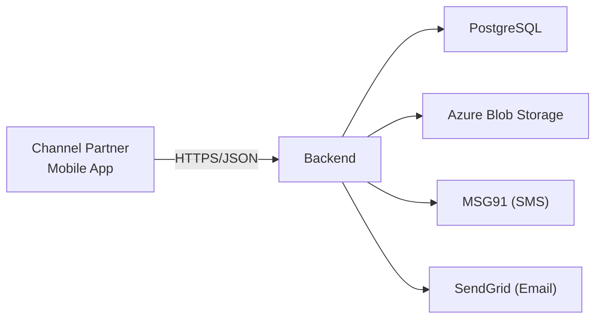
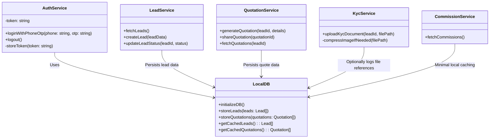
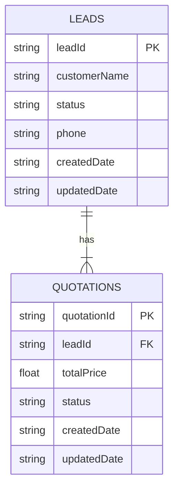
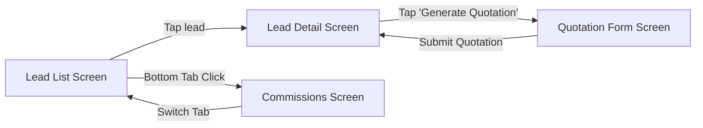
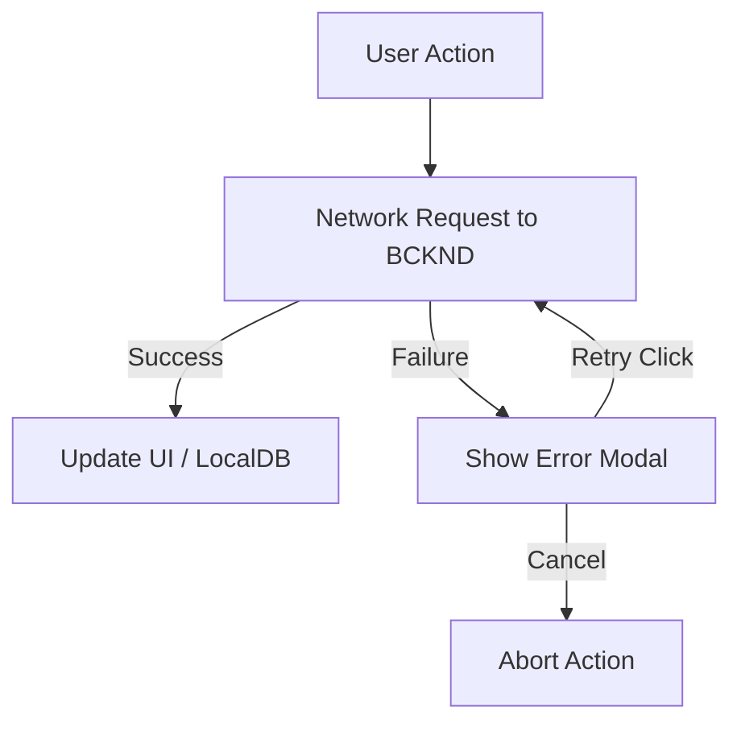
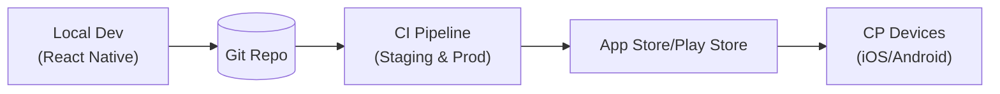
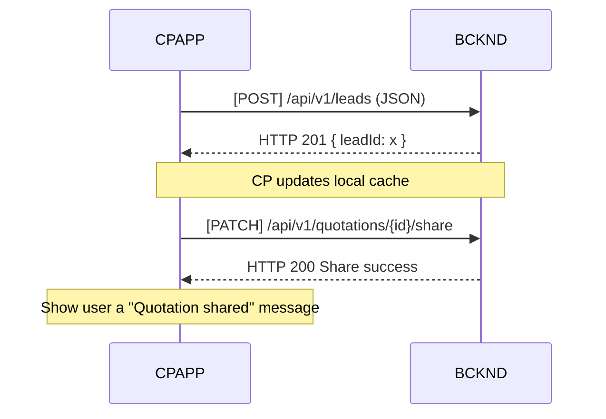

## L3-LLD-CPAPP: Component-Specific Low-Level Design Document for CPAPP Document

This document provides a comprehensive low-level design (LLD) for the Channel Partner App (CPAPP) within the Solarium Green Energy solution. It consolidates relevant information from higher-level documents (including L1-HLD and L2-LLD-IC) and incorporates important client clarifications to guide developers in effectively implementing, integrating, and maintaining this component.

---

## 1. Component Context

### 1.1 Position in Overall Architecture
The CPAPP (Channel Partner Mobile App) is a React Native application used by Channel Partners (CPs) to manage leads, generate and share quotations, upload KYC documents, and visualize commissions. As described in the L1-HLD, the CPAPP communicates exclusively with the Backend (BCKND) via HTTPS REST APIs. The BCKND interacts with PostgreSQL (structured data), Azure Blob (documents), and external services (MSG91 for SMS OTP, SendGrid for emails).

Below is a simplified reference diagram (from L1-HLD) adapted to show CPAPP's position:



### 1.2 Key Interaction Points
• Authentication: CP login and logout via phone-based OTP.  
• Lead Management: Create/edit leads, view lead details, status changes.  
• Quotation Management: Generate, update, share, and track quotations.  
• KYC Document Upload: Upload customer KYC documents.  
• Commission Overview: View commissions (pending and paid), with minimal UI—no dispute functionality.  

---

## 2. Component-Level Detailed Design

This section details how CPAPP is structured internally, including module definitions, data storage, and internal workflows. It integrates approved client clarifications regarding offline read-only caching, manual retry for failed requests, and a single-shot file upload with basic compression.

### 2.1 Modules and Responsibilities

1. Authentication Module  
   - Handles OTP-based login and logout flows.  
   - Manages token storage (using AsyncStorage) and session expiration checks.  
   - Initiates phone-based OTP requests via BCKND.

2. Lead Management Module  
   - Displays lead lists and individual lead details.  
   - Allows CPs to create new leads or update existing ones (when online).  
   - Restricts offline writes to maintain data integrity.

3. Quotation Module  
   - Enables generating quotations, attaching relevant product data, and finalizing pricing.  
   - Allows CPs to share quotations with customers (triggers BCKND to send PDF link or relevant info).  
   - Reflects “Customer Accepted” status if the customer has accepted in their own app.

4. KYC Document Module  
   - Integrates with the device camera or file picker to select images/PDFs (up to 10 MB).  
   - Optionally compresses images before uploading.  
   - Uses a single-shot upload to the BCKND-provided SAS URL for Azure Blob.

5. Commission Module  
   - Shows CP’s commissions labeled as “Pending” or “Paid.”  
   - No in-app dispute mechanism; disputes handled offline if needed.

6. Local Caching & Offline Storage Module  
   - Maintains a local SQLite database for storing essential lead and quotation data offline (read-only usage).  
   - Performs limited background sync (every few hours or on app launch) to keep local data updated.  
   - Blocks any write attempts when offline to avoid data integrity issues.

7. Sync & Network Module  
   - Orchestrates manual and periodic background synchronization with the BCKND.  
   - Implements a “manual retry on failure” approach if uploads or submissions fail mid-request.  
   - Detects conflicts (receiving a 409 from BCKND) and prompts the user to refresh data.

8. Redux/State Management Layer  
   - Implements Redux Toolkit (with Redux-Persist or RTK Query) to manage shared app state (leads, quotations, commissions).  
   - Coordinates with the Local SQLite DB for offline data, ensuring data is normalized for UI components.

### 2.2 Class Diagram (High-Level)

Below is a simplified UML class diagram showing key classes and their relationships within CPAPP’s internal codebase (React Native/TypeScript). Note that React components are not fully enumerated here; instead, we focus on services and data models.



### 2.3 Database Schema (Offline Cache in SQLite)

To support the read-only offline mode, CPAPP stores essential lead and quotation data locally. Below is an ER diagram of the main tables in SQLite:



• Table LEADS: minimal columns to display in offline mode (leadId, name, phone, statuses).  
• Table QUOTATIONS: references LEADS via leadId, storing basic price or status.  
• Complex or large data (e.g., PDF docs) is not cached in SQLite.

### 2.4 Algorithm & Logic Specifications

1. Offline Read Caching  
   - On app launch or periodic intervals, CPAPP fetches the latest leads and quotations from BCKND.  
   - If online, the data is written to the LocalDB and Redux store.  
   - If offline, no writes are allowed; user sees the last-known cached data in read-only form.

2. Lead Creation Workflow (Online)  
   - CP enters lead details in the UI.  
   - calls LeadService.createLead() → BCKND (POST /api/v1/leads).  
   - On success, CPAPP updates LocalDB with the new lead record and merges Redux state accordingly.

3. Quotation Generation & Sharing  
   - CP selects a lead → fill in product details → calls QuotationService.generateQuotation().  
   - BCKND returns new quotation ID → stored in LocalDB + Redux.  
   - Sharing triggers QuotationService.shareQuotation() → BCKND updates status, optionally notifies customer.

4. Manual Retry on Failure  
   - If a request fails mid-transmission (e.g., poor network), an error is displayed.  
   - User may tap “Retry” to resubmit the request. No automatic queue or background retry.

5. KYC Document Upload  
   - Opens device camera/picker → optional image compression → requests BCKND for a SAS upload URL.  
   - CPAPP performs a single-shot upload with that URL. If any failure occurs, the user can re-try manually.

### 2.5 Performance Optimization Techniques

- **Pagination**: Large lead sets fetched in pages from BCKND, limiting memory usage.  
- **Selective Sync**: Only relevant leads/quotations for the CP are fetched, not the entire dataset.  
- **Memoization**: Key screens (e.g., lead list) use memoized selectors for smoother UI.  
- **Image Compression**: Minimally compress large images to reduce upload size/time.  

### 2.6 Unit Testing Plans

- **AuthService Tests**: Validate correct handling of successful/failed OTP logins, token storage, logout flows.  
- **LeadService & QuotationService Tests**: Confirm correct request payloads, data parsing, and local DB updates.  
- **LocalDB Tests**: Check DB migrations, data insertion, retrieval under valid/invalid conditions.  
- **UI Component Tests**: Snapshot and functional tests for core screens (LeadList, LeadDetail, QuotationForm).  
- **Mocking**: Use libraries (Jest + React Native Testing Library) to mock network requests and local database calls.

---

## 3. User Interface (UI) and User Experience (UX) Design

### 3.1 Global Layout
CPAPP uses React Navigation v6 with bottom tabs to separate key sections:
- Leads  
- Quotations  
- Commissions  
- Profile (including logout, password change if applicable)

### 3.2 Screen Layouts and Mockups (Representative)

• Lead List Screen  
   - Displays a paginated list of leads, with search/filter.  
   - Floating button to create a new lead (online only).  

• Lead Detail Screen  
   - Shows lead info (name, status, phone).  
   - Button to generate a quotation if the lead is in an appropriate status.  

• Quotation Screen  
   - List of quotations linked to the lead, with an option to generate a new one.  
   - “Share” button triggers the shareQuotation() method.  

• Commissions Screen  
   - Shows a simple list grouping commissions by “Pending” or “Paid.”  
   - No dispute button or advanced review features.

### 3.3 User Interaction Flow
Below is a simplified flow diagram for navigating leads → quotations → commissions:



- Each screen fetches up-to-date data from Redux or triggers a network call if needed.  
- If offline, the user sees cached data, and any create/update action is blocked with a prompt.  

### 3.4 Endpoint Associations
• Lead List Screen → GET /api/v1/leads  
• Lead Detail Screen → PATCH /api/v1/leads/{id}/status, GET /api/v1/leads/{id}  
• Quotation Form Screen → POST /api/v1/quotations, PATCH /api/v1/quotations/{id}/share  
• Commissions Screen → GET /api/v1/commissions (Admin approval handled in web portal)

---

## 4. API Specifications

At a high level, CPAPP calls the BCKND’s REST endpoints for core features:

1. Auth (OTP)  
   - Purpose: Obtain and verify OTP for CP login.  
   - Endpoint: POST /api/v1/auth/login (phone-based).  
   - Authorization Required: None (initially).  
   - Methods: POST (request OTP), POST (verify OTP).

2. Leads  
   - Purpose: Create, retrieve, update lead information.  
   - Endpoint: /api/v1/leads  
   - Authorization Required: Bearer token (role=CP).  
   - Methods: GET, POST, PATCH.

3. Quotations  
   - Purpose: Manage quotations linked to a specific lead.  
   - Endpoint: /api/v1/quotations  
   - Authorization Required: Bearer token (role=CP).  
   - Methods: GET, POST, PATCH.

4. Documents  
   - Purpose: Upload or retrieve KYC documents.  
   - Endpoint: /api/v1/kycDocuments  
   - Authorization Required: Bearer token (role=CP).  
   - Methods: POST (upload via SAS token flow).

5. Commissions  
   - Purpose: View commission details for the CP user.  
   - Endpoint: /api/v1/commissions  
   - Authorization Required: Bearer token (role=CP).  
   - Methods: GET.

All requests and responses use JSON over HTTPS, returning standard success/error envelopes with relevant status codes.

---

## 5. Security Design Details

### 5.1 Authentication & Authorization
- CP logs in via phone number + OTP. On success, BCKND issues a JWT with role="CP" and a short expiration (e.g., 24 hours).  
- CPAPP stores tokens in AsyncStorage for simplicity; once expired, forces re-OTP to re-authenticate.

### 5.2 Data Protection Measures
- All data in transit is encrypted with TLS 1.2+.  
- Locally cached data is stored in SQLite plus Redux Persist. Sensitive fields (like KYC data) are not fully retained offline; only minimal references are cached.  
- Basic image compression occurs before file uploads to reduce data size.

### 5.3 Concurrency & Conflict Handling
- Uses a last-write-wins approach. If a 409 conflict occurs, CPAPP prompts the user to refresh the lead data.  
- Critical fields (commission payouts, final lead status overrides) are generally restricted to Admin/KAM on the web portal.

---

## 6. Error Handling and Logging

### 6.1 Error Handling Strategies
- **Manual Retry on Failure**: If network calls fail, a modal prompts “Retry” or “Cancel.”  
- **Conflict (409) Handling**: If BCKND returns 409 due to lead status mismatch, CPAPP alerts the user and refreshes.  
- **Offline Blocks**: Attempts to write data offline are disallowed, returning a local error message “No network connection. Changes cannot be saved.”

### 6.2 Logging Framework
- Minimal local logging (via console.log or React Native’s debug).  
- For production, critical errors can be reported to an external telemetry service (e.g. App Center or Crashlytics) if configured.  
- No sensitive data (like OTPs or tokens) is logged to ensure security.

Below is a flowchart illustrating error propagation:



---

## 7. Deployment and Environment Configuration

### 7.1 Environment Specifications
- **Development**: Connects to a staging BCKND environment, enabling debug logs and hot-reload.  
- **Production**: Points to the live BCKND. Release builds are minified and code-signed.  
- Simple single-pipeline approach in CI/CD: staging branch → production branch.

### 7.2 Deployment Diagram
Below is a high-level representation of how CPAPP is built and released:



Developers push code to Git, triggering CI. After QA, new versions are published to the App/Play Store. CPs update the app on their devices.

---

## 8. Documentation and Coding Standards

- **Language & Framework**: TypeScript-based React Native with Redux Toolkit.  
- **Code Style**: Enforced by ESLint and Prettier.  
- **In-Code Documentation**: Use JSDoc or TSDoc for public methods in services (AuthService, LeadService, etc.).  
- **Repo Structure**: Kept in a monorepo with other Solarium apps (CUSTAP, WEBPRT) for shared code synergy.  

---

## 9. Compliance and Regulatory Requirements

- 7-year retention policy for KYC documents is enforced on the backend; CPAPP simply uploads.  
- No advanced data purging logic in CPAPP.  
- CP data privacy: We only store minimal offline data to reduce risk if a device is lost/stolen.

---

## 10. Internationalization and Localization

Currently, the CPAPP is primarily in English. Future multi-language support can be layered using React Native i18n libraries. The design is flexible enough to accommodate string-based translations if required.

---

## 11. Cross-Component Interface Contract

- **Interaction**: CPAPP → BCKND via REST.  
- **Data Contracts**: CPAPP sends JSON with lead/quotation data. BCKND responds with success/error.  
- **Events**: No push notifications; CPAPP manually fetches status changes.  
- **Error Handling**: BCKND returns 4xx or 5xx codes. CPAPP handles them with user prompts and potential refresh.

Below is a diagram showing the request/response flow:



---

## 12. Inter-Component Communication Standards

- **HTTP + JSON**: CPAPP abides by the same JSON request/response pattern as other frontends (CUSTAP, WEBPRT).  
- **API Versioning**: CPAPP consumes /api/v1. No advanced version negotiation.  
- **Rate Limiting**: CP usage is not intensive enough to warrant advanced throttling at current scale (~400–600 concurrent users).  
- **Security**: Uses short-lived JWT tokens in the “Authorization: Bearer” header.

---

## 13. Distributed Operations Requirements

- **Data Consistency**: BCKND is source of truth. Offline data in CPAPP is read-only, limiting conflict scenarios.  
- **State Management**: CPAPP updates local caches after successful server writes.  
- **Monitoring**: Basic app analytics via a third-party or built-in React Native logging if needed.  
- **No advanced transaction patterns** are required given the “last-write-wins” approach fits current concurrency scale.

---

## Conclusion

This L3-LLD for CPAPP outlines the internal architecture, modules, data design, and user flows to enable Channel Partners to manage leads and quotations effectively. By adhering to the decisions from L1-HLD, L2-LLD-IC, and the client clarifications (e.g., limited offline caching, single-shot file uploads, minimal commissioning display, manual retries), the CPAPP remains focused, secure, and scalable to roughly 400–600 concurrent users. Further enhancements—such as offline writes or advanced dispute handling—can be addressed in future iterations if business needs grow.

```
