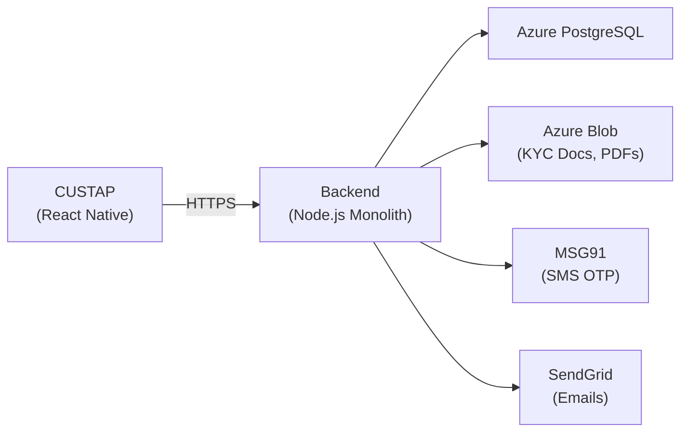
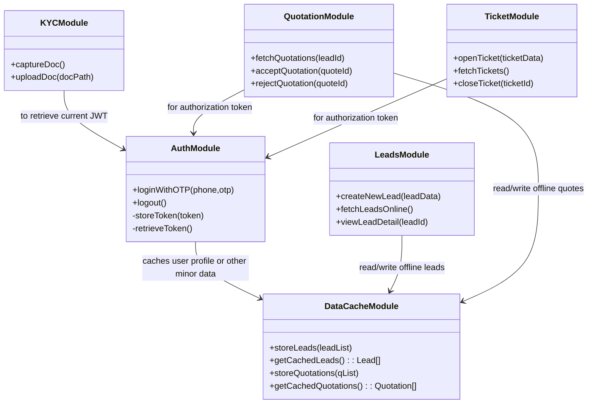
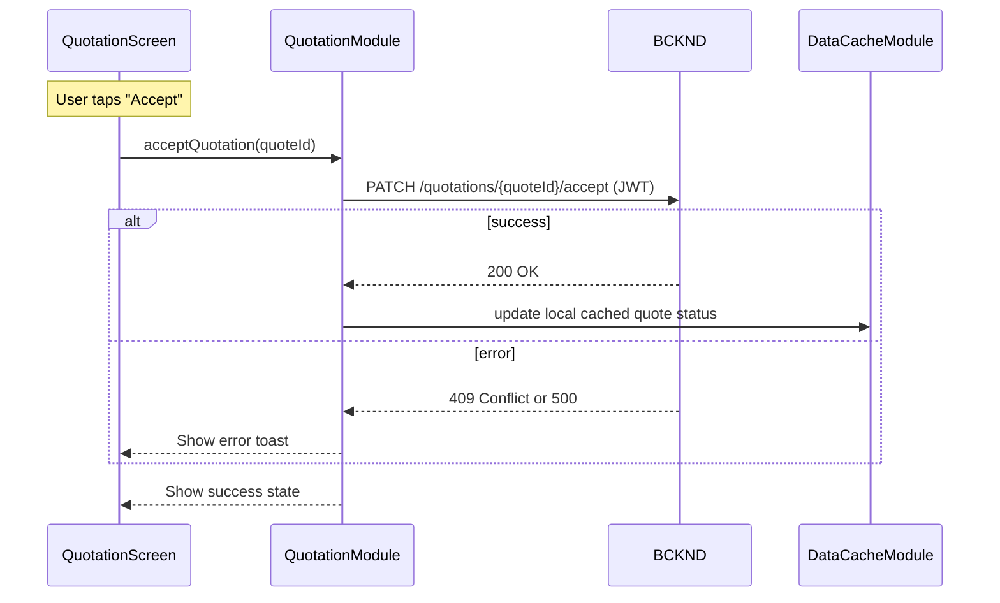
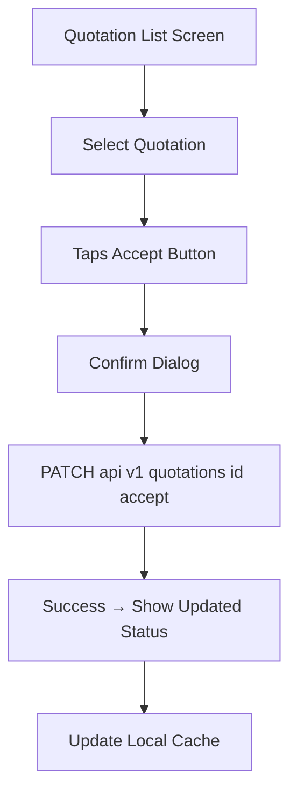
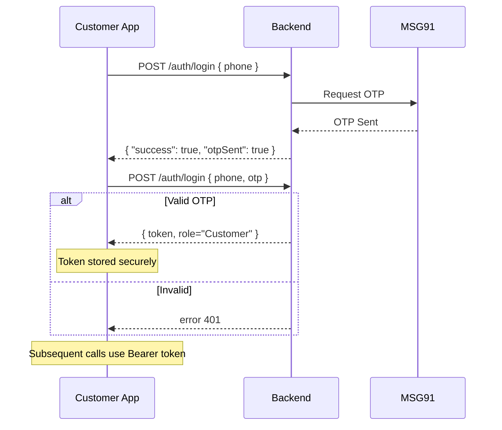
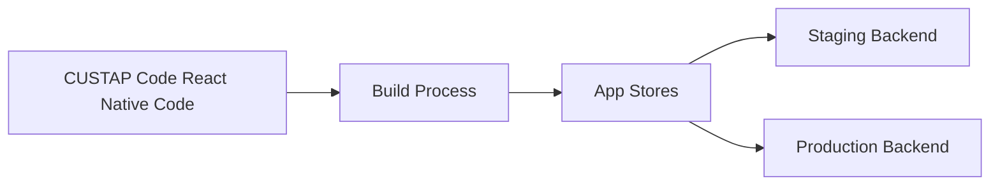

## L3-LLD-CUSTAP: Component-Specific Low-Level Design Document for CUSTAP Document

This document provides a comprehensive low-level design of the CUSTAP (Customer App) component in the Solarium Green Energy solution. It incorporates relevant decisions from higher-level (L1 and L2) documents, focusing on how the CUSTAP is implemented in a React Native environment to meet the current scale of approximately 400–600 concurrent system users. All designs herein emphasize maintainability, clarity, and strict alignment with the confirmed clarifications provided by the client.

---

## 1. Component Context

### 1.1 Overview
The Customer App (CUSTAP) is a React Native mobile application enabling end customers to:  
- Register and log in via phone + OTP.  
- Submit service requests (which become leads in the backend).  
- Upload KYC documents to support their leads.  
- View and accept or reject quotations.  
- Create simple support tickets (intended to be created primarily after project execution as stated in L1-HLD, though the app design currently allows opening them at any time).

This app communicates exclusively with the backend (BCKND) using HTTPS REST calls (JSON). It does not communicate directly with other front-end components (CPAPP or WEBPRT). All data writes require an online connection; only a limited read-only offline cache is maintained locally.

### 1.2 High-Level Architecture Fit
Below is a high-level reference of where CUSTAP fits into the Solarium system (based on L1-HLD and L2-LLD-IC):

• CUSTAP obtains a JWT upon successful OTP login.  
• CUSTAP can upload documents by requesting a short-lived SAS URL from BCKND, then uploading directly to Azure Blob.  
• All business logic is enforced by the BCKND; the app must follow the backend’s status and validation checks.

### 1.3 Relation to L2-LLD-IC
Following the L2-LLD-IC design, the CUSTAP:  
- Uses common endpoint patterns under /api/v1 (e.g., leads, quotations, documents).  
- Implements device-side data caching for read-only offline viewing.  
- Relies on manual pull-to-refresh to update local data.  
- Honors role-based access by presenting only relevant features for the “Customer” role.

---

## 2. Detailed Design

### 2.1 Module Descriptions
CUSTAP is organized into logical modules within the React Native codebase:

1. AuthModule  
   - Handles phone entry, OTP request, and OTP verification.  
   - Stores the JWT token preferably in secure storage (e.g., Keychain/KewStore) though currently AsyncStorage is used after login.  

2. DataCacheModule  
   - Manages read-only offline data (e.g., last 10–20 leads and quotations).  
   - Exposes methods like `storeLeads()` and `getCachedLeads()` for local retrieval.  

3. LeadsModule  
   - Screens and utility methods for creating new service requests (leads).  
   - Fetches existing leads (filtered by user phone).  
   - Displays lead details in offline or online mode.  

4. QuotationModule  
   - Screens to display quotations.  
   - Allows “Accept” or “Reject” for entire quotes (all-or-nothing).  
   - Integrates with DataCacheModule to update relevant offline data.  

5. KYCModule  
   - Uses device camera or file picker to capture documents (under 10 MB).  
   - Requests short-lived SAS URL from BCKND, then PUTs the file to Azure Blob.  
   - Enforces a maximum of 7 attachments per lead, matching the L1-HLD constraints. Once a lead accumulates 7 files, additional uploads are blocked or warned.  
   - Implements basic compression/resizing prompt if file exceeds size limit.  

6. TicketModule  
   - Simple creation and viewing of support tickets (“Open” or “Closed”).  
   - Ticket creation is recommended primarily after project execution, aligning with L1-HLD. The design, however, allows the user to open tickets at any time if needed.  

7. CommonUI  
   - Shared React Native components: headers, footers, modals, forms.  
   - Houses common styles, button components, and toasts/notifications.

### 2.2 Class Diagram (Conceptual)
Below is a simplified UML-style class diagram illustrating key classes and their relationships. Note: in React Native, these classes often correspond to functional or class-based components and supporting services.

### 2.3 Internal Data Handling and Offline Cache
- Minimal key-value storage via AsyncStorage for leads, quotations, and user info.  
- Offline read-only: user can view previously fetched leads/quotes if internet is unavailable.  
- Manual refresh triggers an API call to pull the latest data; the local cache is updated upon success.

### 2.4 No Formal Database Schema for CUSTAP
Since the Customer App stores its data locally only for caching and does not have a direct relational database, there is no dedicated DB schema. All persistent data resides on the Backend, while CUSTAP uses AsyncStorage (or secure OS-level storage) to cache a small subset of user-specific data.

### 2.5 Algorithms and Logic

#### 2.5.1 OTP Authentication Flow
1. User enters phone number → calls `/auth/login` with `{phone}`.  
2. BCKND triggers OTP via MSG91.  
3. User enters OTP → calls `/auth/login` with `{phone, otp}`.  
4. Upon success, BCKND returns `{token, role="Customer"}`.  
5. CUSTAP stores the token in secure storage (recommended) or AsyncStorage for subsequent requests.  
6. For security, the app enforces up to 5 OTP attempts; if exceeded, a 15-minute lockout period is applied, matching the logic used for CP verification in L2-LLD-IC.

#### 2.5.2 Quotation Acceptance
1. App fetches quotations via `GET /quotations?leadId=xxx`.  
2. User reviews the final pricing.  
3. User taps “Accept Quotation.”  
   - The app calls `PATCH /quotations/{quoteId}/accept` with JWT in headers.  
   - On success, the lead transitions to “Customer Accepted” in the backend.  
4. The local cache is updated to reflect accepted quotation status.

A simplified internal sequence diagram for the acceptance logic:

#### 2.5.3 KYC Document Upload Flow
1. User selects or captures an image/PDF (up to 10 MB).  
2. The app calls /api/v1/kycDocuments or /api/v1/documents/sas (according to the L2-LLD-IC) to request pre-signed SAS URL for the relevant docId.  
3. The app uploads the file directly to Azure Blob with a PUT request.  
4. The app or BCKND then verifies the upload; no extra callback endpoint is currently used unless L2 is updated to specify it.  
5. If the file is over 10 MB, the user is prompted to compress or reduce the size before retrying the upload.  

### 2.6 Performance Optimization Techniques
- Manual refresh only (pull-to-refresh or on resume) to reduce periodic polling overhead.  
- Caching only the most recent leads or quotations to limit local storage.  
- Minimal memory usage by clearing large documents from cache after upload or after they’re no longer needed.  

### 2.7 Unit Testing Plans
- Use Jest and React Native Testing Library for unit and component tests.  
- Mock network calls to test offline flows and error states.  
- Validate local caching logic with boundary tests (e.g., storing 20 leads max, removing older records).  
- Test edge cases for large file uploads and OTP expiration flows.

---

## 3. User Interface (UI) and User Experience (UX) Design

### 3.1 Global Layout
- A consistent top header showing “Solarium Customer” branding.  
- A bottom tab navigator with primary sections (Leads, Tickets, Profile).  
- Global theme (colors, fonts) shared across all screens.

### 3.2 Screen Layouts & Mockups
Each major feature has a dedicated screen, using stacked navigation. Example wireframes:

1. Home Screen (Lists recent leads, quick access to “New Request” button).  
2. Lead Detail Screen (Shows lead info, embedded “View Quotations” button if available).  
3. Quotation Screen (Displays all quotations for a lead; “Accept” or “Reject” button).  
4. KYC Upload Screen (Camera or gallery picker, then a “Confirm Upload” action).  
5. Tickets Screen (List of tickets with an “Open Ticket” button; ticket detail if one is selected).

### 3.3 Responsive Layout
- Primarily targeting mobile portrait orientation.  
- Tablet or large screens scale up fonts and spacing proportionally.  
- Minimal context alignment changes between phone and tablet.

### 3.4 User Interaction Flows

Below is a simplified interaction flow diagram for a user who wants to accept a quotation:

#### Screen-to-Endpoint Mappings
- Lead Detail Screen → `GET /leads/{leadId}`, `GET /quotations?leadId=xxx`  
- Quotation Detail → `PATCH /quotations/{quoteId}/accept` or `/reject`  
- KYC Upload → `POST /api/v1/kycDocuments` → `PUT` to Blob  
- Tickets → `POST /api/v1/tickets`, `GET /api/v1/tickets`

---

## 4. API Specifications (Minimal Summary)
Below are key endpoint usages by CUSTAP. Full details remain in L2-LLD-IC and backend docs.

1. Auth (OTP-Based)  
   - Purpose: Login user by phone+OTP, retrieve JWT.  
   - Endpoint: `POST /api/v1/auth/login`  
   - Authorization Required: None at first request; OTP check returns JWT.  
   - Methods: POST  

2. Leads  
   - Purpose: Create or read user’s leads.  
   - Endpoint: `/api/v1/leads` (GET, POST)  
   - Authorization Required: JWT with role=Customer  
   - Methods: GET, POST  

3. Quotations  
   - Purpose: Retrieve quotes, accept/reject them.  
   - Endpoint: `/api/v1/quotations`  
   - Authorization Required: JWT with role=Customer  
   - Methods: GET, PATCH  

4. Documents (KYC)  
   - Purpose: Upload & manage KYC docs.  
   - Endpoint: `/api/v1/kycDocuments` and `/api/v1/documents/sas` for short-lived download/upload URLs  
   - Authorization Required: JWT with role=Customer  
   - Methods: POST (+ PUT to Azure Blob via SAS URL)  

5. Tickets  
   - Purpose: Create & view support tickets.  
   - Endpoint: `/api/v1/tickets`  
   - Referenced in L1-HLD and L3-LLD-CUSTAP. The L2-LLD-IC will include or update definitions for ticket endpoints to align cross-component understanding.  
   - Authorization Required: JWT with role=Customer  
   - Methods: GET, POST, PATCH  

---

## 5. Security Design Details

### 5.1 Authentication and Authorization
- OTP-based login: user phone number uniqueness enforced.  
- There is no automatic token refresh mechanism; once the JWT expires, the user must re-login.  
- We recommend storing tokens in Keychain (iOS) or Keystore (Android) instead of plain AsyncStorage for improved security.  
- All calls use TLS 1.2+.

### 5.2 Data Protection
- Documents up to 10 MB are uploaded with short-lived SAS URLs from the BCKND.  
- The app never stores full KYC docs locally once uploaded.  
- At-rest encryption handled by Azure Blob for the final storage.

### 5.3 Role-Enforced Endpoints
- The backend checks the “Customer” role for all CUSTAP requests.  
- Attempting to access Admin or CP-only endpoints returns HTTP 403, ensuring boundary enforcement.

### 5.4 Security Flow Diagram
Below is a simple flow diagram depicting the token issuance and usage for OTP-based login, followed by request authorization checks:

---

## 6. Error Handling and Logging

### 6.1 Error Handling Strategies
- Local form validation for mandatory fields (e.g., phone number, OTP).  
- On receiving a 4xx/5xx from the backend, the app shows user-friendly messages (e.g., “Network Error,” “Invalid OTP,” “Conflict with Quotation Status”).  
- For 409 conflicts (e.g., lead is locked, or quote is no longer valid), the app prompts the user to retry or refresh data.

### 6.2 Logging
- Basic console.log for debugging in development builds.  
- Production builds limit logs to critical errors.  
- Optional integration with an error-reporting service (e.g., Sentry) if needed in future.

---

## 7. Deployment and Environment Configuration

### 7.1 Build & Distribution
- Built in React Native for Android (Play Store) and iOS (App Store).  
- Manage environment variables (API endpoints, environment flags) via .env files.  
- Separate staging and production backend URLs to test app flows before public release.

### 7.2 Environments
1. Development/Staging  
   - Connects to a staging backend environment.  
   - Primarily for QA, internal testing with test users.  
2. Production  
   - Connects to the live backend in Azure production region.  
   - Real user base with ~400–600 concurrent system users overall.

### 7.3 Mobile Deployment Diagram

• The React Native code is built through CI/CD pipeline.  
• Staging build points to the Staging Backend.  
• Production build points to the Production Backend.  
• Artifacts are deployed to the app stores for end users.

---

## 8. Documentation and Coding Standards

- Follow a consistent folder structure (screens, modules, common, etc.).  
- Enforce ESLint and Prettier for code consistency.  
- Use meaningful commit messages referencing tasks or tickets.  
- Inline JSDoc comments for core functions (e.g., uploading an image, parsing leads).

---

## 9. Compliance and Regulatory Requirements

- Customer phone number is used for login, adhering to solution constraints (one phone number = one user).  
- KYC docs retained up to 7 years in Azure Blob as required by the overall business rules.  
- No extra compliance implications for the mobile app side at present.

---

## 10. Internationalization and Localization

- Currently English-only.  
- Prepared for future expansions by storing user-visible text in a separate constants file or i18n module if needed.

---

## 11. Cross-Component Interface Contract

For CUSTAP:
- Accepts JSON data from the BCKND.  
- Respects the role-based endpoints defined in L2-LLD-IC.  
- No direct CPAPP or WEBPRT integration.  
- Data exchange handles only the “Customer” domain (leads, quotations, KYC docs, tickets).

Data validation rules:
- Basic client-side checks (required fields).  
- Final validation on BCKND for lead creation, KYC doc association, or quoting constraints.

Error propagation rules:
- BCKND returns standardized JSON with success/error.  
- The app shows error dialogs for 400, 401, 403, 409, 500 statuses.

---

## 12. Inter-Component Communication Standards

- Communication is synchronous (HTTP REST).  
- REST endpoints use versioned base path (/api/v1), JSON payloads, JWT Bearer tokens.  
- No advanced rate limiting required for ~400–600 concurrent user scale.  
- Timeouts and reconnection handled by standard fetch/axios retries if needed.

---

## 13. Distributed Operations Requirements

- The mobile app remains a stateless consumer aside from the local AsyncStorage cache.  
- Concurrency conflicts resolved by the backend’s “last-write-wins” logic.  
- No dedicated transaction boundary needed on the device; each operation is individually committed to the server.

---

## 14. Diagrams Recap

1. **Component Context (Mermaid Flowchart)**  
2. **Class Diagram (Mermaid UML)**  
3. **Quotation Acceptance Sequence Diagram**  
4. **UI Interaction Flow for Quotation Acceptance**  
5. Security Flow Diagram  
6. Mobile Deployment Diagram

These diagrams collectively illustrate the internal structure, data flows, security flows, deployment approach, and external interactions of CUSTAP.

---

## End of Document