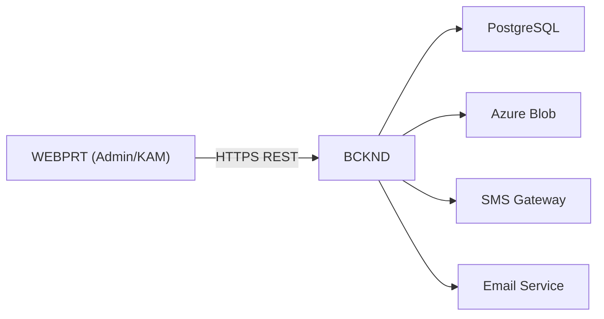
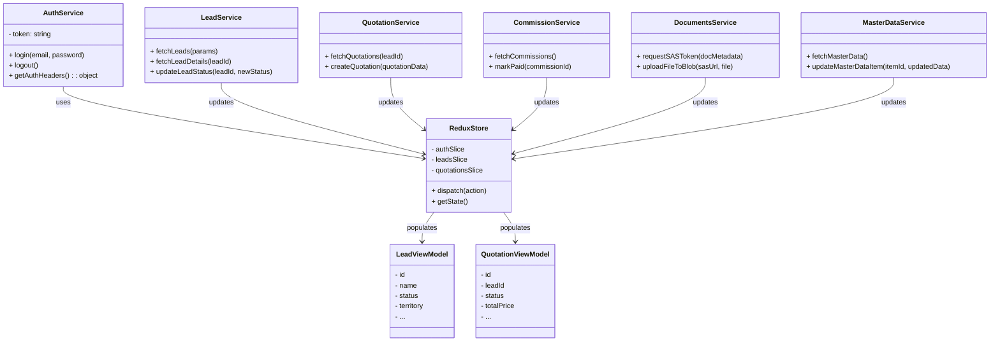
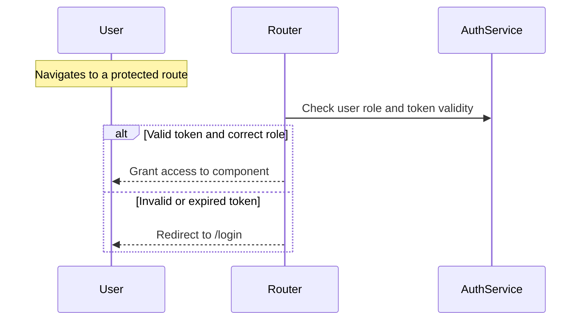
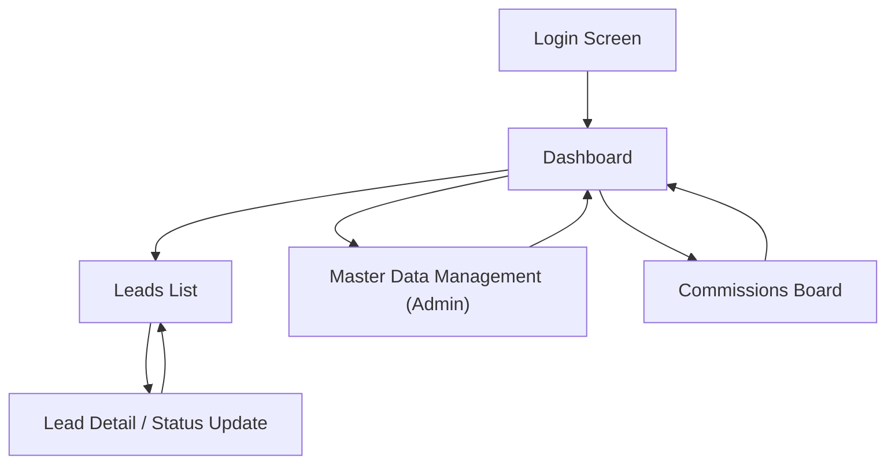
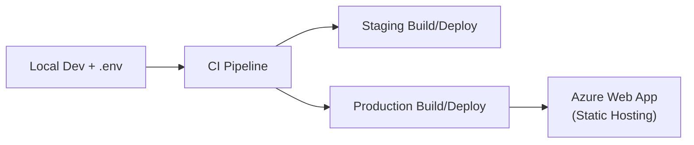

## L3-LLD-WEBPRT: Component-Specific Low-Level Design Document for WEBPRT Document

This revised document incorporates additional clarifications regarding token expiration, telemetry scope, attachment limits, and session management. It addresses previously noted inconsistencies and ensures alignment with the overall system scale (~400–600 concurrent users).

### 1. Introduction
This Low-Level Design (LLD) document provides a comprehensive guide to implementing the Web Portal (WEBPRT) component of the Solarium Green Energy solution. WEBPRT is a React + TypeScript Single Page Application (SPA) servicing both Admin and Key Account Manager (KAM) roles. It facilitates lead management, quotations, user administration, commission oversight, and master data maintenance.

Building on the L1-HLD (high-level architecture) and L2-LLD-IC (inter-component interaction), this document details how WEBPRT is structured internally, including its modules, data flows, security, deployment, and UI/UX specifics. It clarifies that JWT tokens are short-lived and require manual re-login upon expiry, that only minimal console logging is used on the front-end, while the backend leverages Azure Monitor and Application Insights for advanced telemetry. 

• Thin client-specific models for UI (instead of heavy backend DTO mirroring).  
• A single route set with role-based conditional rendering (Admin vs. KAM).  
• Server-side filtering of leads based on KAM territories.  
• Simpler on-demand data fetching (no centralized caching layer).  
• Redux Toolkit for state management.  
• Build-time environment variables.  
• No advanced external telemetry is configured in the front-end, with minimal console logging used.  
• JWT stored in localStorage (with awareness of potential XSS risks).  
• Simple PUT uploads for file attachments (~10 MB max).  
• Localized client-side error toasts.

Note: We do not implement any silent token refresh mechanism; once the token expires, the user must re-authenticate.

---

### 2. Component Context
The WEBPRT fits into the overall Solarium architecture (see L1-HLD) as the primary interface for Admin and KAM roles. It connects to the Backend (BCKND) for all business logic, data retrieval, and file uploads. It does not interact directly with the Channel Partner App (CPAPP) or Customer App (CUSTAP); these communicate indirectly with Admin/KAM via the shared BCKND.

#### 2.1 High-Level Interaction Diagram
Below is a simplified view of how the WEBPRT interacts with the BACKEND and supporting services:

• WEBPRT displays or manages leads, quotations, commissions, user profiles, and master data.  
• BCKND enforces role-based rules (Admin vs. KAM).  
• PostgreSQL is the live data store; Azure Blob holds uploaded documents/PDFs.

---

### 3. Detailed Design

#### 3.1 Module Descriptions
The SPA is logically organized into feature-based modules. Each module corresponds to an area of functionality, surfacing “thin” view models that transform backend data into simpler UI representations.

1. Auth Module  
   • Handles login flow (email/password for Admin/KAM).  
   • Manages JWT storage in localStorage and route guards.

2. Leads Module  
   • Displays lead lists (fetched server-side with territory filters for KAM).  
   • Allows lead detail views, status changes, and reassignments when role = Admin or KAM.

3. Quotation Module  
   • Facilitates quotation creation or updates if user has appropriate privileges.  
     
   • Offers a read-only view for KAM if region-limited.  
   • Ties into PDF generation endpoints, which produce Blob-stored documents.

4. Commissions Module  
   • Surfaces commission records.  
   • Admin can mark them “Paid.”  
   • KAM has read-only or partial approval privileges based on territory assignments.

5. Master Data Module  
   • Admin-only.  
   • Maintains list of panels, inverters, cost parameters.  
   • KAM sees read-only references if needed.

6. KYC & Documents Module  
   • Handles pre-signed SAS generation for file uploads (single PUT ~10 MB).  
   • Renders statuses for KYC approvals.  
   • Enforces a maximum of 7 total attachments per lead, displaying a user-friendly error if the threshold is reached.

7. Shared & Core Utilities  
   • Reusable UI components (tables, modals, form elements).  
   • Redux Toolkit store for cross-module state management (user info, ephemeral UI states).

#### 3.2 Class Diagram (Conceptual)
The following simplified UML diagram shows major classes or “logical constructs” within the portal code base. (Note: “class” here refers to conceptual grouping in a React + TypeScript context; actual code may use function components, hooks, etc.)

Key points:  
• AuthService provides JWT-based headers.  
• Services call BCKND endpoints; they update the Redux store with simplified view models.  
• The UI layer (React components) subscribes to Redux slices to render data.

#### 3.3 Database Schema Relevance
WEBPRT does not maintain its own data storage; it relies entirely on BCKND’s PostgreSQL. Hence, no local DB schema is required. However, Redux store structures partially mirror relevant domain data (Lead, Quotation, Commission, etc.) in simplified form.

#### 3.4 Algorithms & Logic
• Route Guard Logic:  
  - On each route, the application checks if the user’s role is authorized. Otherwise, it redirects to an “unauthorized” or “login” page.  
  - Single route set, toggling or disabling features if user is KAM vs. Admin.

• Server-Side KAM Territory Filtering:  
  - The portal requests leads with a territory parameter derived from the user’s stored profile.  
  - The BCKND enforces territory constraints, returning only leads in the KAM scope.

• Data Fetch & State Mgmt:  
  - Each screen dispatches a “fetch” action on mount to retrieve data from BCKND.  
  - Minimal caching is performed, primarily storing results in Redux slices.

• File Upload Flow (~10 MB limit):  
  - The module requests a SAS token from BCKND.  
  - The user’s browser directly PUTs the file to Azure Blob with a progress callback.  
  - On success, the BCKND is notified to link the file reference.  
  - The system enforces a maximum of 7 attachments for each lead, preventing further uploads beyond that limit.

• Performance Considerations:  
  - The UI is tested to handle up to ~600 concurrent users.  
  - Redux slices and subscription updates remain straightforward for typical usage without heavy real-time demands.  
  - Minimal code splitting and lazy loading are used to reduce initial bundle size, balancing load times with maintainability.

##### 3.4.1 Route Guard Flow (Sample)

This diagram illustrates how route guards verify token presence/role, ensuring only authorized users can access restricted views.

---

### 4. User Interface and UX Design

#### 4.1 Screen Layouts & Global Layout
1. Global Layout:  
   - Header with application logo, user info, role indicator (Admin/KAM).  
   - A left-side navigation menu that conditionally hides or disables Admin-only links.  
   - Main content area reflects the current route.

2. Minimal Top 10 Screens (examples):  
   - Login Screen  
   - Leads List Screen  
   - Lead Details/Status Change Screen  
   - Quotation List Screen  
   - Quotation Detail/Create Screen  
   - Commissions Board Screen  
   - Master Data Management Screen (Admin only)  
   - KYC Approvals Screen (Admin/KAM)  
   - User/Profile Management Screen (Admin)  
   - Dashboard/Overview Screen  

#### 4.2 User Interaction Flows
Below is a sample screen navigation flow for typical Admin usage:

• The user logs in, sees the Dashboard, navigates to different modules via the side menu, and logs out when done.

#### 4.3 Responsiveness
While primarily designed for desktop usage, the portal includes basic responsive techniques:
- Use of flexible layouts (CSS grid/flex) to adapt to mid-range tablet sizes.
- A simplified mobile layout for essential pages if viewed on smaller screens.
- Testing at standard breakpoints (e.g., 768px, 1024px) ensures core functionality remains accessible.

---

### 5. API Specifications (High-Level)
Below are minimal endpoint usage examples. For complete details, refer to L2-LLD-IC.

1. Auth  
   • Purpose: Authenticate Admin/KAM and obtain JWT.  
   • Endpoint: POST /api/v1/auth/login  
   • Authorization Required: None (login).  
   • Methods: POST  
   • Description: Validates credentials; returns role-based token.

2. Leads  
   • Purpose: Fetch or update lead information.  
   • Endpoint: GET /api/v1/leads … PATCH /api/v1/leads/{leadId}/status  
   • Authorization Required: Admin or KAM.  
   • Methods: GET, PATCH  
   • Description: Retrieves lead data (server-side filters for KAM’s territory), updates status if role allows.

3. Master Data  
   • Purpose: Manage core product/inverter data.  
   • Endpoint: /api/v1/masterdata  
   • Authorization Required: Admin.  
   • Methods: GET, POST, PATCH  
   • Description: Admin can add/edit or delete items.

4. Commissions  
   • Purpose: Approve payout or mark as paid.  
   • Endpoint: /api/v1/commissions/{id}  
   • Authorization Required: Admin (for final payment).  
   • Methods: GET, PATCH  
   • Description: Allows the Admin to finalize commission payouts.

5. Quotation  
   • Purpose: Create, share, or finalize quotations (Admin/KAM).  
   • Endpoint: /api/v1/quotations  
   • Authorization Required: Admin/KAM  
   • Methods: GET, POST, PATCH  
   • Description: Admin or KAM can create new quotations or share them. Acceptance is performed by the Customer, not in WEBPRT.

---

### 6. Security Design Details
• Authentication & Authorization:  
  - Users authenticate via email/password. BCKND returns a JWT containing the user’s role.  
  - The SPA stores that JWT in localStorage. While this meets current scale requirements, it can pose XSS risks if malicious scripts are introduced. Implementing Content Security Policies (CSP) and rigorous input sanitization is recommended to minimize vulnerability.  
  - Route guards check “Admin” or “KAM” before allowing certain UI actions.

• Data Protection:  
  - All traffic is over HTTPS (TLS 1.2+).  
  - Short-lived SAS tokens are used for direct file uploads.  
  - Minimal offline data is stored—only ephemeral Redux states.

• Role-Based Access:  
  - Single route definition with dynamic checks. If user.role != "Admin" (or “KAM” for certain screens), the UI either hides or disables the restricted feature.

#### 6.1 Session Management & Token Expiry
- Tokens are short-lived (e.g., 30 minutes of inactivity). When they expire, the user must re-login; no automatic refresh token mechanism is provided.  
- A global HTTP interceptor catches 401 responses. Upon encountering a 401, the portal clears localStorage, redirects to /login, and displays a relevant “Session expired” message to maintain a clear UX.

---

### 7. Error Handling and Logging
• Error Handling Strategy:  
  - API call failures trigger user-friendly toasts or modal alerts.  
  - The application logs details to the console for debugging in development.  
  - The front-end does not implement advanced external telemetry. However, the backend leverages Azure Monitor and Application Insights for server-side logging and metrics.

• Typical Flow:  
  1. Redux action calls an API.  
  2. If error, the service returns an error object.  
  3. The UI displays a localized error toast, e.g., “Unable to update lead due to invalid status.”

---

### 8. Deployment and Environment Configuration
• Build-Time Variables:  
  - The SPA uses environment-specific .env files for dev/staging/production.  
  - The base API URL (REACT_APP_API_BASE_URL) is injected at build time, requiring separate builds per environment.  
  Alternatively, a future enhancement could load runtime configurations (e.g., from a /config.json) to reduce the need for multiple build artifacts.

• Deployment Approach:  
  - After building (e.g., via GitHub Actions or Azure DevOps), static files are uploaded to an Azure Web App or Azure Storage + CDN.  
  - The main index.html and bundled JavaScript references the environment variables at runtime (baked at build-time).

• The user downloads the SPA from the hosting environment, which references the BCKND’s REST APIs.

---

### 9. Documentation and Coding Standards
• Code Conventions:  
  - Using React + TypeScript with function components.  
  - Linting rules (ESLint + Prettier) enforce consistent formatting.  
  - Redux Toolkit to maintain a standardized approach to state slices.

• Documentation:  
  - Inline JSDoc-style comments for complex components or utilities.  
  - README outlines local dev setup, environment configs.

#### 9.1 Unit Testing & Coverage
We use Jest and React Testing Library to ensure component and service reliability. Key points:
- Each module (Auth, Leads, Quotation, etc.) has corresponding test files verifying logic and UI rendering.
- Mocks are employed for external APIs, ensuring fast, isolated tests.
- Our CI pipeline enforces minimum coverage thresholds, promoting a stable and maintainable codebase.

---

### 10. Compliance and Regulatory Requirements
Currently, no specialized regulatory constraints (e.g., GDPR) are mandated beyond a 7-year data retention policy for lead/documents. The main compliance factor is ensuring user-level data access is restricted by role, which is enforced by the BCKND’s RBAC. The portal surfaces these restrictions in the UI.

---

### 11. Internationalization and Localization
No immediate i18n requirements have been described. The portal defaults to English. If future expansions need multi-language support, we would integrate a library like react-i18next, adding localized string resources for each UI text.

---

### 12. Cross-Component Interface Contract
• WEBPRT solely communicates with the BCKND via REST, aligning with L2-LLD-IC definitions.  
• Data Contracts:  
  - Thin view models for leads, quotations, commissions.  
  - BCKND returns JSON with standard success/error structures.  
• Error Handling:  
  - HTTP 4xx for client/role issues, 5xx for server errors.  
  - The portal displays toasts for user feedback.

---

### 13. Inter-Component Communication Standards
• Synchronous REST calls only.  
• All endpoints follow /api/v1 version format, as specified in L2-LLD-IC.  
• Security:  
  - The token is appended as Authorization: "Bearer <JWT>" in headers.  
  - No advanced push or websockets; data refresh is done on-demand or manual screen reload.

---

### 14. Distributed Operations Requirements
• WEBPRT is purely a front-end SPA; it has no separate, horizontally distributed layers.  
• Collaboration Conflicts:  
  - If multiple Admin/KAM attempt to change the same lead, the BCKND’s last-write-wins logic (with optional 409 conflict) prevails.  
  - The portal simply surfaces any conflict as an error toast for user retry.  
• Monitoring:  
  - Basic client monitoring (console logs). The backend integrates with Azure Monitor for deeper telemetry.

Note: "No centralized caching layer" means no dedicated caching infrastructure. Redux is used for ephemeral, short-lived state, rather than a formal caching solution.

---

### 15. Summary & Conclusion
WEBPRT’s implementation focuses on clarity, maintainability, and alignment with current concurrency requirements (~400–600 users). By applying React + TypeScript, Redux Toolkit, and deliberate role checks, the portal remains straightforward yet robust. It leverages on-demand data fetch, a short-lived token approach requiring manual re-login, server-side territory filtering for KAM, single route definitions with role-based toggles, and localStorage for JWT (with recommended XSS mitigations). Additionally, the maximum of 7 file attachments per lead is enforced, ensuring alignment with solution-wide storage and retention policies.

End of L3-LLD-WEBPRT Document