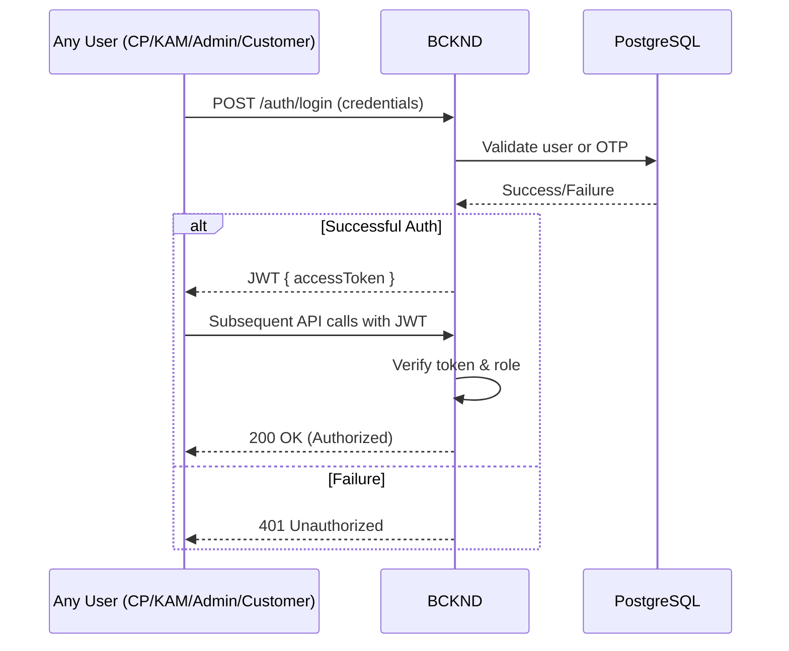
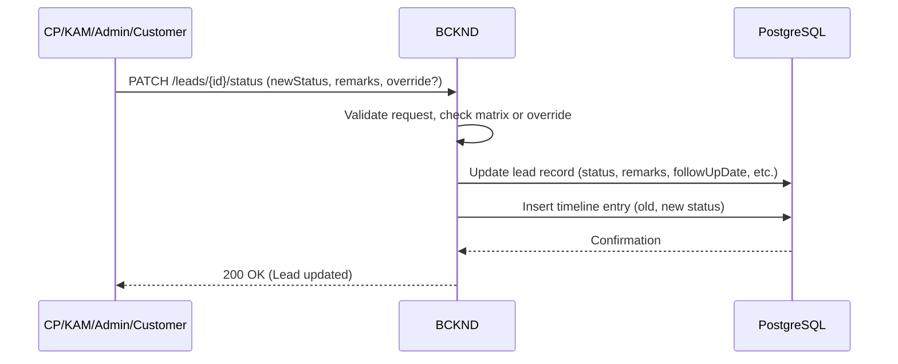
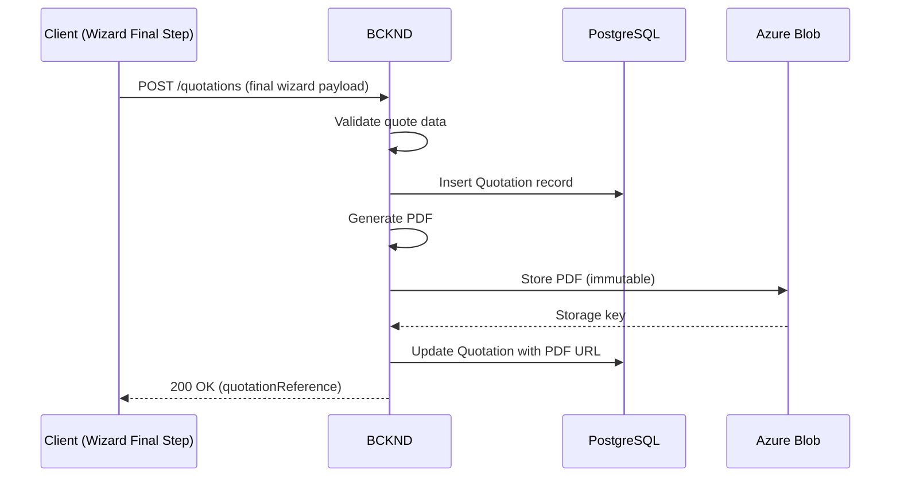
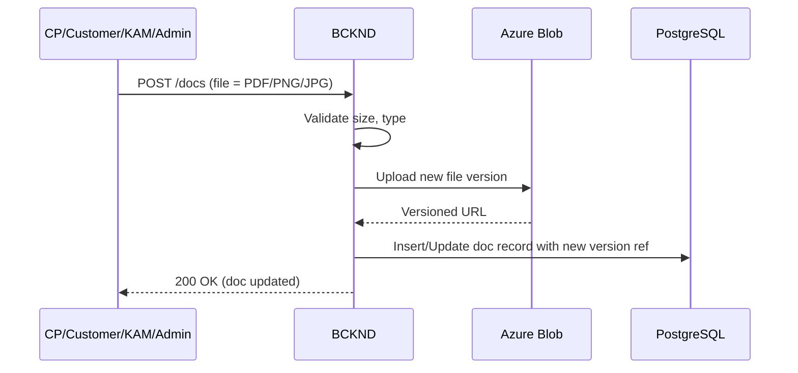
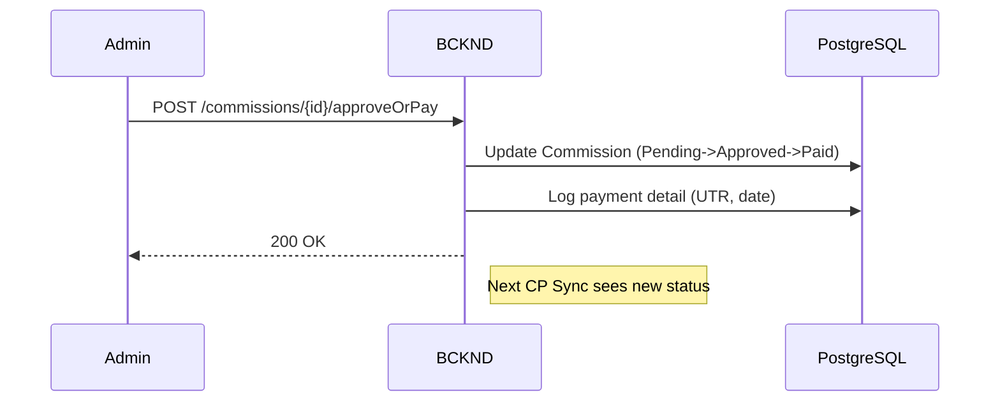
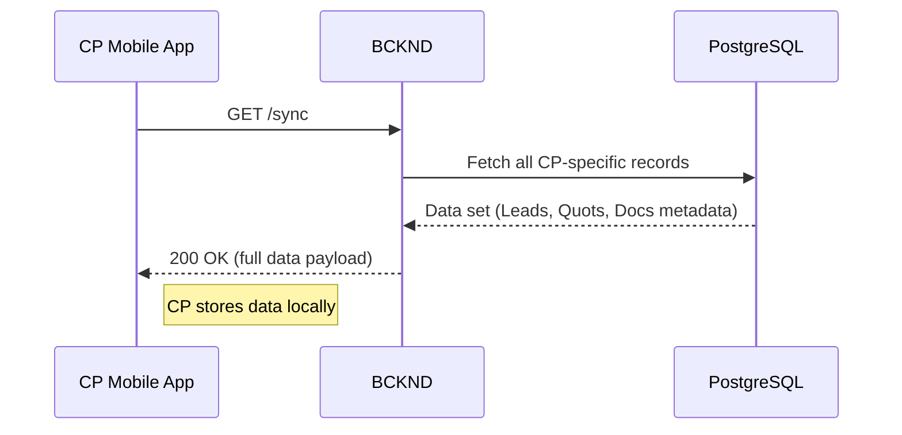

## L3-WF-BCKND: Workflow Details for BCKND: This component is responsible for central orchestration and data management.

This document describes how the backend (BCKND) orchestrates data flows, enforces business rules, and integrates external services for Solarium Green Energy, focusing on pragmatic solutions that match the current scale of ~400–600 concurrent users.

This document provides component-level workflow details for the backend (BCKND) of Solarium Green Energy’s solution. The backend is a “modular monolith” responsible for managing all server-side business logic, data persistence, and integration tasks. It has no direct user interface but responds to requests made by the mobile apps (CPAPP, CUSTAP) and the web-based portal (WEBPRT). The workflows below outline how BCKND processes incoming requests, enforces business rules, maintains consistency, and integrates with external services.

---

## 1. Scope and Purpose

This document details the system-level behaviors of the BCKND component, describing how it processes incoming user actions (like lead status updates or quotation wizard finalization) and handles internal tasks (document versioning, commission tracking). By centralizing data persistence, business logic, and integration adapters, the BCKND ensures consistent enforcement of rules and data integrity at the current expected scale.

---

## 2. Key Responsibilities

Below are the BCKND's primary duties and the scope of work it handles in our system architecture.

### 2.1 Authentication & Authorization
This area addresses how the BCKND ensures that all user logins (CP, Customer, KAM, Admin) are validated securely and that only the correct role-based endpoints are accessible.

- Issue and validate JWT tokens for Admin, KAM, CP, and Customer logins.  
- Enforce role-based endpoints, reflecting the system’s RBAC (Admin vs. KAM vs. CP vs. Customer).  

### 2.2 Business Logic Execution
This focuses on enforcing the lead status matrix, applying concurrency rules (last-write-wins), and ensuring proper transitions while allowing Admin/KAM overrides where necessary.

- Implement lead status matrix constraints while allowing Admin/KAM override.  
- Manage concurrency with a “last-write-wins” approach. Although simpler, this can lead to silent overwrites. A future enhancement could add an optimistic concurrency check or explicit "force" flag for conflicting edits at higher usage scales.  
- Enforce final immutability of Quotation PDFs and store them for up to 7 years.  

### 2.3 Data Persistence & Versioning
This covers how the BCKND stores leads, quotations, and documents, preserving older versions in case reversion or auditing is needed.

- Store leads, quotations, documents, and timeline entries in Azure Database for PostgreSQL.  
- Keep older document versions in Azure Blob Storage, pointing to the newest version in the database.  

### 2.4 Integration & Notifications
This section describes how external services (SMS, email) and in-app polling-based notifications are triggered, along with the planned (but not yet implemented) push channels.

- Send OTPs via MSG91 and emails via SendGrid.  
- Provide data for frontend polling or manual refresh; real-time push notifications are not currently implemented, though the system may adopt FCM or APNs in future if expanded.  

---

## 3. General Workflow Conventions

The following points describe the overall design philosophy and approach to concurrency, validations, and data flows that apply to all subsequent workflows.

1. **Concurrency Handling**  
   If multiple agents submit conflicting changes for a lead record, the backend commits the latest request (“last-write-wins”). All attempts are logged in the timeline for audit. Given the current scale of ~400–600 concurrent users, this approach is considered acceptable, though caution is advised when multiple roles simultaneously edit the same lead. Future iterations may include an optimistic locking mechanism if concurrency conflicts become problematic.

2. **Lead Status Matrix & Overrides**  
   The BCKND enforces status transitions for standard user roles (CP, Customer). However, Admin and KAM can override transitions at will. Every update logs an entry in the timeline. This is “soft validation,” easing data correction over time.  
   If CP or Customer attempts an invalid transition (e.g., jumping from "New Lead" directly to "Won"), the BCKND returns an HTTP 400/422 with a clear error message, indicating “Invalid status transition.”

3. **Quotation Submission**  
   Quotations are only persisted server-side after the final (7th) step. The intermediate steps are held client-side. Once persisted, the BCKND generates an immutable PDF and stores it in Azure Blob.

4. **Document Management**  
   When a document is re-uploaded under “Pending Review” or “Rejected,” the previous version remains stored in Blob (versioned) but the lead or customer record updates to reference the latest. The BCKND checks accepted MIME types and file size (≤10 MB).  
   No server-side antivirus scanning or malware detection is performed by default. Stakeholders may optionally enable Azure Defender for Storage or a similar solution to mitigate risks from potentially malicious uploads.

5. **Offline Sync**  
   CPAPP fetches data from the BCKND using a “full data refresh” approach, triggered by either normal or forced sync attempts. This is simpler and deemed acceptable for the current scale.  
   Note that while the L1-WF document references a “full delta pull” on long-press, the actual implementation in BCKND currently provides only complete dataset refreshes. Incremental or partial sync is not supported at this time.

6. **Commission Payouts**  
   Single payment per executed project is tracked. Status transitions: Pending → Approved → Paid. Partial payouts or multi-currency flows are not supported at present.

7. **"Customer Accepted" Status**  
   The BCKND recognizes an optional intermediate status "Customer Accepted" after a customer approves a quotation in the CUSTAP. However, this status is not yet reflected in the L1-WF status matrix. If this step is to remain, the L1-WF must be updated to include “Customer Accepted” and clarify the transition to “Won.” Otherwise, references to “Customer Accepted” in the BCKND should be removed for consistency across all solution documents.

---

## 4. Detailed Workflows

Below are the most critical backend workflows. Each diagram uses Mermaid syntax to illustrate how requests from different components proceed through BCKND, update data, and generate responses or notifications.

### 4.1 User Authentication & Session Management

This workflow describes how any user (Admin/KAM/CP/Customer) obtains a JWT token from the BCKND and how subsequent requests validate the token.

#### Steps:
1. The user submits login credentials (phone+OTP or email+password) to BCKND.  
2. BCKND verifies the credentials (e.g., OTP with MSG91 callback or hashed password check).  
3. If valid, BCKND issues a JWT token signed with a server-side secret.  
4. The client stores the token and includes it in subsequent API requests via an Authorization header.  
5. BCKND middleware inspects and validates the token for each request, extracting role and user ID.  
6. If token is valid, the controller action proceeds; otherwise, it returns an HTTP 401 error.

---

### 4.2 Lead Status Update Workflow

Leads are updated by CPAPP, WEBPRT (Admin/KAM), or CUSTAP (e.g., Customer self-service). The BCKND enforces the normal status transitions but permits Admin/KAM override. In case of concurrent writes, the last request to arrive “wins,” with all changes logged in the lead’s timeline.

#### Steps:
1. CP, KAM, or Admin triggers a status update (e.g., from “New Lead” to “In Discussion”).  
2. BCKND runs status matrix checks:  
   - If user is CP or Customer, only valid transitions are allowed.  
   - If user is Admin/KAM with override set, transitions are accepted even if invalid.  
3. BCKND stores the new lead status, remarks, next follow-up date (if applicable), etc.  
4. BCKND creates a timeline entry capturing the previous state, new state, and user ID.  
5. If multiple updates arrive simultaneously, the BCKND commits the last to reach the database.  
6. Clients can fetch the updated lead, seeing the final status and timeline logs.  
   If the system deems the requested transition invalid (for non-override roles), it returns HTTP 400 or 422, describing the error.

---

### 4.3 Quotation Wizard Finalization

The quotation wizard is handled mostly on the client. The BCKND only stores data when the user (CP or KAM, or Admin in some cases) completes the final step. Once stored, it generates an immutable PDF and logs relevant fields (e.g., cost breakdown, subsidy).

#### Steps:
1. Client (CP, KAM, or Admin) completes all local steps.  
2. At “Save & Share,” the final payload is posted to BCKND (location, panel selection, fees, etc.).  
3. BCKND:  
   - Validates the payload (phase, capacity, subsidy calculations).  
   - Creates a Quotation record in DB.  
   - Generates a PDF representation (internal service or external library).  
   - Writes the PDF to Azure Blob Storage with a unique key.  
4. BCKND returns a “quotationReference” to the client.  
5. If the user chooses to share it with a customer, BCKND flips “sharedWithCustomer” = true.  
   If PDF generation or Blob storage uploads fail, the BCKND returns an HTTP 500 error and does not finalize the quotation; the client should retry or report an error to the user.

---

### 4.4 Document Upload & Versioning

Customers, CPs, and sometimes Admin/KAM can upload documents (KYC or lead docs). The BCKND checks file type/size, stores new versions in Azure Blob Storage, and updates references in DB. Old files remain available for auditing or rollback.

#### Steps:
1. User calls the relevant endpoint (e.g., POST /customers/{id}/kyc or POST /leads/{id}/docs) with the file.  
2. BCKND verifies the file extension, MIME type, and file size (≤10 MB).  
3. BCKND stores the file in Azure Blob with versioning.  
4. BCKND updates the DB record, pointing to the newly uploaded file as the latest version.  
5. BCKND logs an event in the timeline if it’s lead-level, or in KYC logs if it’s customer-level.  
   Before accepting a new lead document, the BCKND checks if the lead already has 7 active documents (as specified in L1-WF). If so, it returns HTTP 409 (Conflict) and an explanatory message, thus enforcing the 7-document limit.  

---

### 4.5 Commission & Payout Updates

Once a lead is “Executed,” the BCKND calculates the CP’s commission from the assigned quotation. Admin then approves or marks it paid. CP sees updates in the app.

#### Steps:
1. Lead transitions to “Executed.” BCKND triggers a commission record creation referencing the final “Won” quotation.  
2. Admin visits the commission queue to “Approve” or “Pay.” The request hits BCKND.  
3. BCKND updates the commission status.  
4. If the status is changed to “Paid,” BCKND records Timestamps, UTR, Payment Method.  
5. The CP receives a notification (poll-based or next time they sync) and sees the updated status.

---

### 4.6 Offline Synchronization for CPAPP

CPAPP attempts data sync each time it goes online or when a user taps “Sync.” BCKND returns a full refresh of leads, statuses, quotations, etc., assigned to that CP.

#### Steps:
1. CPAPP pings BCKND for a sync (GET /sync).  
2. BCKND collects all relevant data for the CP from DB.  
3. BCKND returns the entire data set (leads, statuses, quotations, partial doc references).  
4. CPAPP merges or overwrites local caches.  
5. When offline, CPAPP only displays previously cached data. Any attempt to create or update leads is blocked until connectivity returns.  
Although L1-WF references a “long-press” action for a so-called “delta pull,” no incremental syncing is currently supported. Both normal and forced sync yield a complete data refresh.

---

### 4.7 Notification Approach

While some references in L1-WF mention “push notifications,” the actual system relies on manual polling or sync-based notification checks. This means in-app updates appear once the app syncs or fetches new data. OTP and certain major alerts (e.g., registration approvals) may still be sent via SMS. Future expansions may add real-time push (FCM/APNs) if business requirements evolve.

Immediate “push” notifications (e.g., via FCM or APNs) are not integrated. Instead, the system relies on polling, SMS (for OTP and certain major events), and optional emails for key alerts. While some L1-WF references mention push alerts, these are effectively handled by in-app notification centers that refresh upon each sync or user action. Real-time push could be added in future if the project scope requires it.

---

## 5. Integration Points

This section outlines how the BCKND connects with external services and client apps, ensuring the overall system remains cohesive and consistent.

1. **CPAPP**  
   - Lead creation, lead status updates, doc uploads, offline full refreshes.  

2. **CUSTAP**  
   - Service requests (treated as leads), KYC doc uploads, quotation acceptance (optionally resulting in “Customer Accepted” if recognized), triggers final “Won” by CP or Admin if matrix includes that transitional status.  

3. **WEBPRT**  
   - Full functionality for Admin/KAM: user management, lead overrides, quotation generation, commissions, and system master data.  

4. **External Services**  
   - MSG91 for SMS OTP and certain notifications.  
   - SendGrid for email confirmations.  
   - Azure Blob for storing PDFs and images with versioning.  
   If MSG91 or SendGrid fail (e.g., timeouts), BCKND logs the incident but currently does not retry automatically. Front-end clients may prompt for “Resend OTP” or user re-attempt as a fallback.

---

## 6. Summary of Key Design Choices

Below is a concise explanation of the major technical decisions behind the BCKND workflows, along with rationales suitable for the present scale.

- **Last-Write-Wins Concurrency**: BCKND commits the final request in overlapping lead updates, capturing all changes in timeline logs. Given our user load of ~400–600 concurrent sessions, this is acceptable for now.  
- **Quotation Persistence**: Only final wizard data is stored server-side. Drafts remain client-side.  
- **File Versioning**: Each upload creates a new version in Blob; older versions are not discarded.  
- **No Server-Side Antivirus**: Security relies on file type checks and optional external scanning solutions, aligning with current scale and budget constraints.  
- **Soft Validation for Status Matrix**: Admin/KAM overrides remain logged but are not blocked if the override flag is set.  
- **Full Refresh Offline Sync**: CP always downloads the entire relevant dataset on sync, with no partial/delta approach.  
- **Single-Payment Commission**: Single INR payout, no partial or multi-currency flows.  
- **“Customer Accepted” Status**: If kept, L1-WF and front-end flows must be updated to reference it. Otherwise, removing it from the BCKND will simplify the lead flow to transition directly to “Won.”

---

## 7. Conclusion

The BCKND component unifies data and processes for all users in Solarium’s ecosystem, applying role-based rules, concurrency handling, document versioning, and a well-defined status matrix with the possibility for Admin/KAM override. By retaining older file versions, storing fully immutable quotations, and employing a last-write-wins approach for leads, it addresses the current requirements without overengineering.

For error handling, the BCKND returns clear error codes (400/422/409/500) to highlight invalid transitions, excessive document uploads, or service failures. The timeline entries and logs provide traceability if corrections are required.

Future expansions might introduce push notifications, incremental sync, or advanced concurrency checks if system usage and business needs outgrow these initial design choices. For implementation details (URL paths, request/response schemas, error codes), please refer to the forthcoming L3-LLD-BCKND document.

Note: References in L1-WF to “push notifications” and “delta sync” should be reviewed in light of the current BCKND design, which employs polling and full data refreshes respectively, unless L1-WF is updated or push/delta-sync functionality is introduced.