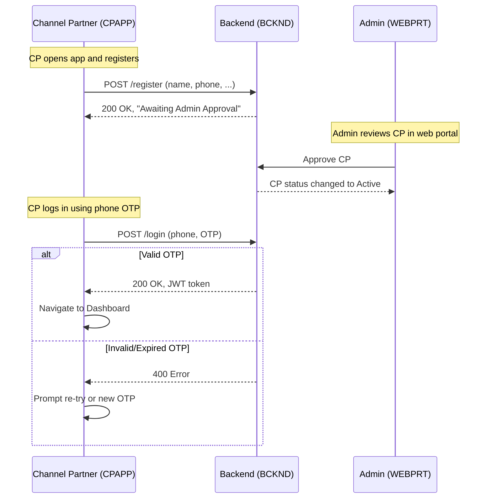
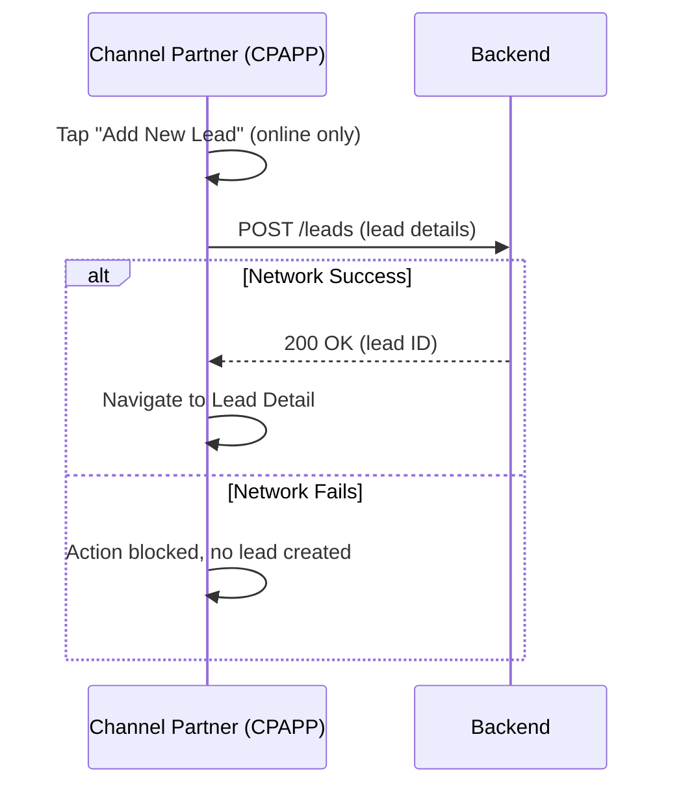
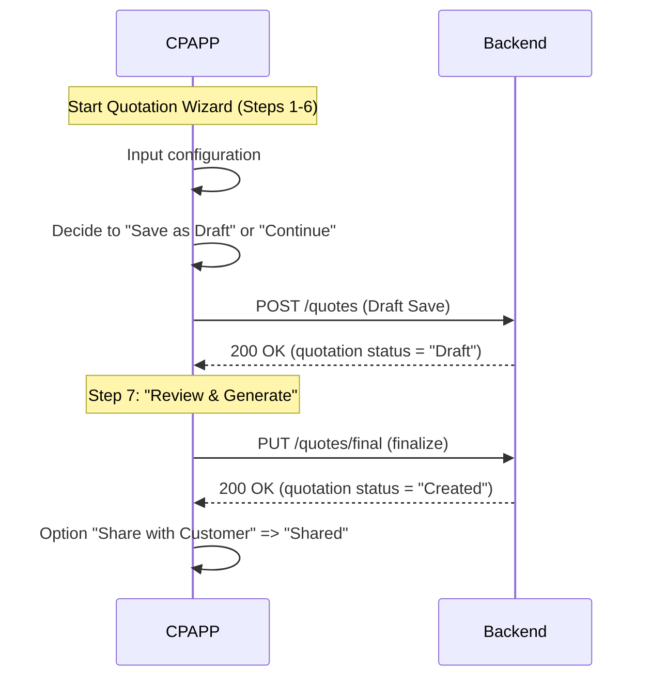

## L3-WF-CPAPP: Workflow Details for CPAPP (Revised to include “Customer Accepted” status, “Draft” quotations, and other clarifications)

All additions, deletions, or edits in this revised document are specifically marked with “<add>…</add>”, “<delete>…</delete>”, or “<edit>…</edit>” tags.

---

## 1. Document Purpose (Introductory Context)
This document provides a detailed, updated guide for the Channel Partner Mobile App (CPAPP). Major updates include:
- Incorporation of a new “Customer Accepted” status to match L1-OVERVIEW.  
- Inclusion of “Draft” as a valid quotation status, clarifying how partial or initially saved quotations behave.  
- Clarifications on duplicate phone number handling (simple error message, no complex merging).  
- Additional notes on OTP error handling and disclaimers for single vs. multiple device logins.  
- Introduction of brief explanatory paragraphs at the start of each section or subsection for clarity.

---

## Overview and Scope
This sectionexplains how the CPAPP supports registration, lead management, quotations, and commission tracking. Channel Partners use it to create and manage leads; generate and share quotations; upload lead-specific and KYC documents; and track status transitions that now include a “Customer Accepted” intermediary step before “Won.” The CPAPP also disables all CRUD actions when offline, per L1 guidelines, ensuring consistency in data integrity.

 All data created or updated within CPAPP is stored in the backend system (BCKND) via REST APIs. Cross-functional workflows reference the updated L1 status matrix, which explicitly includes “Customer Accepted” as an interim state once a customer approves a quotation via the Customer App. CPs subsequently finalize the lead to “Won.”

---

## Authentication and Sessions

This section outlines how Channel Partners register, handle OTP-based login, manage potential OTP errors, and how Admin approval and main session rules are enforced.  

### Registration & Admin Approval
1. The prospective CP downloads the “Solarium Green Energy- Channel Partner” app.  
2. Opens the app; on the login screen, taps “Register.”  
3. Submits a registration form with required details (Name, Phone, Address, PIN, etc.).  
4. Enters the received 6-digit OTP to verify the phone. If successful, the CP sees “Awaiting Admin Approval.”  
5. An Admin reviews and approves the new CP in the Web Portal.  
6. Upon approval, CP receives an SMS confirmation and can now log in.

### Login Procedure and OTP Error Handling
This subsection details the login flow once a CP is approved.

1. CP enters the registered phone number and taps “Get OTP.”  
2. CP receives a 6-digit OTP via SMS (valid for 2 minutes).  
3. Upon correct OTP entry, the server issues a JWT token (auto-refreshed every 24 hours).  
4. The CP is navigated to the Home Dashboard screen.  
5. If an OTP is invalid or expired, the CP sees an error prompt (“OTP invalid or expired, please request a new one”) and must tap “Get OTP” again to retry.

### Session Rules and Inactivity
- Token Auto-Refresh: Every 24 hours, the app attempts a silent refresh. If refresh fails, the app re-prompts for OTP.  
- Hard Logout: After 30 days of inactivity, the token becomes invalid, forcing the CP to log in again.  
-   Currently, the CP can log in on multiple devices without forced logout on other devices. If future business policy requires single-session enforcement, that change will be introduced in a subsequent L1 update.>  
- Push Token Handling: The CPAPP updates the push notification token if it changes or after a forced logout.

---

## Home Dashboard

This section introduces the main user interface that CPs see after logging in, describing top bar functions, lead metrics, and action buttons.

Upon successful login, the CP sees the main dashboard. Key UI elements:

- **Top Bar**:  
  - Sync button (↕) to trigger a data sync.  
  - Notifications icon (bell) with a badge count if there are unread notifications.  
  - Profile icon to access personal settings (name, email, address).  

- **Widget Strip**:  
  - “Today’s Pending” leads.  
  - “Overdue” leads.  
  - “Total Leads.”  

- **Floating Action Button (FAB)**: “Add New Lead,” enabled only if online.

- **Bottom Navigation**: Home | My Leads | Quotation | Customers.

If the CP is offline, the app shows an “Offline Mode” indicator and blocks all new creations/updates.

---

## Leads Management

This section explains how CPs create, view, and update leads, including phone-number uniqueness requirements, valid status transitions (with the newly added “Customer Accepted” status), and disclaimers about offline restrictions.

### Leads List and Overview
1. The CP can tap “My Leads” from the bottom navigation to view all leads.  
2. The list supports search and filter by name, status, phone, or date.  
3. Leads are sorted by the next scheduled follow-up date (older first).  
4. Each lead card shows status, next follow-up date, and relevant icons for quick actions.

### Adding a New Lead
1. CP taps the (FAB) “Add New Lead,” which is only visible if online.  
2. A form prompts for: Name, Phone, Address, State, PIN, optional email, optional documents, required service selection from the catalog, etc.  
3. CP taps “Save.” The system creates a new lead record with:  
   - Status = “New Lead.”  
   - Follow-up date = tomorrow by default.  
   - Origin = CP.  
4. The CP sees a toast: “Lead created” and is taken to the new Lead Detail screen.  
5. If a network failure is detected before saving, the CP cannot proceed. The “Add New Lead” workflow is blocked when offline, consistent with L1 guidelines.

### Lead Detail
Tapping any lead in the list or after creating a new lead shows the Lead Detail screen. It has six sections: Info, Status, Quotations, Lead Docs, Customer, and Timeline.

#### 1) Info

 CP can view/edit name, phone, email, city/state, PIN.  
- The system enforces unique phone numbers at the Customer level. If a duplicate phone is detected for a brand-new customer, an error is shown (“Phone number already exists”) and the CP cannot proceed. No complex merging is supported at this time.

#### 2) Status
- Shows a dropdown with valid next statuses based on the updated matrix:  
  - “New Lead” → “In Discussion,” “Physical Meeting Assigned,” “Not Responding,” “Not Interested,” “Other Territory.”  
  - “In Discussion” → “Physical Meeting Assigned,” “Customer Accepted,” “Won,” “Not Responding,” “Not Interested,” “Other Territory.”  
  - “Customer Accepted” → “Won” (used after the customer digitally approves a quotation; the CP or Admin finalizes it to “Won”). 
  - “Physical Meeting Assigned” → “Won,” “Not Responding,” “Not Interested,” “Other Territory.”  
  - “Won” → “Pending at Solarium.”  
  - “Pending at Solarium” → “Under Execution.”  
  - “Under Execution” → “Executed.”  
  - Terminal states: “Executed,” “Not Responding,” “Not Interested,” “Other Territory.”  

- Certain statuses require extra fields:  
  - Next follow-up date (for non-terminal states, range 0–30 days).  
  - Quotation Reference # (when choosing “Won”). Any generated quotation mapped to the lead may appear in this dropdown, matching L1.  
  - Token No. (when choosing “Under Execution”).  
  - Remarks (≥ 10 characters) required for all status changes.

#### 3) Quotations
- A chronological list of existing quotations, each with a PDF download link, share status, and creation date.  

- Each quotation now has one of three statuses: “Draft,” “Created,” or “Shared.”  
  - “Draft”: When a CP has partially configured the quotation but not finalized/immutable-saved it.  
  - “Created”: Once the CP completes the wizard and taps “Save & Continue,” the quotation becomes immutable.  
  - “Shared”: Indicates the quotation is visible to the customer (e.g., the CP tapped “Share with Customer”).

- “Generate New” opens the Quotation Wizard.

#### 4) Lead Docs
- Library of up to 7 documents (PDF/JPG/PNG, ≤10 MB each) specifically for this lead (e.g., site photos, notes).  
- CP can upload or delete lead-level documents if online.  
- These documents do not require approval (for reference only).

#### 5) Customer Section
- Display of all known customer details if the phone number matches an existing record. If new, a customer record is automatically created, provided the phone is unique.  
- CP can see or upload KYC documents for the mapped customer.  
- KYC doc statuses can be “Pending Review,” “Approved,” or “Rejected.” Already “Approved” docs cannot be replaced.  
- CP can re-upload “Rejected” or “Pending Review” docs; newly uploaded KYC docs revert to “Pending Review.”

#### 6) Timeline
- Immutable history of all changes, including user name, timestamp, and description of the change.  
- Shows before→after for each modification.

---

## Quotation Workflows

This section explains the process of creating, editing, and sharing quotations, including how the newly introduced “Draft” status operates and clarifies that CPs must be online to complete quotes.

Quotations form the basis for finalizing sales with customers. The CP can generate multiple quotes for each lead, share them with customers, and finalize them only when online.

### 7-Step Quotation Wizard (High-Level)
1. **Location**: State, DISCOM, Phase, Smart Meter flag.  
2. **Panels**: Panel make, variant (auto-sets DCR yes/no), number of panels.  
3. **Inverter & BOM**: Inverter selection (±15% capacity match), cable type, extra structure height.  
4. **Fees Lookup**: Automated read-only page listing fees (Discom Fee, installation, meter charges, etc.).  
5. **Dealer Add-on**: A per-kW markup (0 to ₹2,000, default ₹1,800).  
6. **Pricing & Subsidy**:  
   - Shows hardware subtotal, inflated base price (×1.10), plus user’s add-on.  
   - Calculates state and central subsidies if applicable.  
7. **Review & Generate**:
   - If the CP saves partway through (and the app implements local or server “Draft”), the quotation remains in “Draft.” Finalizing the wizard with “Save & Continue” transitions it to “Created.”  
   - Tapping “Share with Customer” sets the status to “Shared.”  
   - The final record is immutable once stored in “Created” or “Shared.”

### Sharing & Acceptance
1. A quotation’s “Share” flag is toggled once CP taps “Share with Customer.”  
2. In alignment with L1, any generated quotation mapped to the lead is eligible for selection when status changes to “Won.”  
3. If the Customer approves a quotation in the Customer App, the system sets the lead status to “Customer Accepted.” The CP can then confirm and finalize the lead as “Won.”

### No Partial Save for Offline  
CPAPP does not permit offline partial saves or continuing a wizard sequence offline. All quotation steps require an active connection. If the connection drops, the CP must retry once online.

---

## KYC and Document Management

This section clarifies how CPs manage KYC documents (associated with the Customer record and subject to Admin/KAM approval) versus lead documents (unrestricted references for site or project details).

### Customer KYC
1. CP can upload or re-upload KYC docs in the “Customer” section of a Lead Detail or in the “Customers” tab.  
2. Approved KYC docs cannot be deleted or replaced.  
3. Admin/KAM reviews doc, changing status to “Approved” or “Rejected.”  
4. Once a doc is rejected, the CP can upload a new version.

### Lead Docs
1. Up to 7 lead-specific documents can be uploaded by the CP.  
2. The CP can delete these lead-level docs at any time unless restricted by Admin or a backend rule.  
3. These documents do not require approval (for reference only).  

### Duplicate Number or Document Conflicts  
If a CP attempts to add a new customer with a phone number already in the system, the app shows an error and stops the creation. No merging flow is provided at this time.

---

## Commission & Earnings Tracking

This section covers how CPs review execution-based commissions in the CPAPP, along with notifications upon approval or payment by Admin/KAM.

### Earnings Screen
1. The CP can open “Earnings” from the side menu.  
2. A list of leads with final status “Executed” and their corresponding commission amounts is displayed.  
3. Each row shows the project capacity, commission amount, and payment status (“Pending,” “Approved,” or “Paid”).

### Commission Notifications
- When an Admin updates a commission record to “Approved” or “Paid,” the CP receives a push notification and sees the updated status accordingly.  
- A lifetime summary of total commissions is shown at the top (pending, approved, paid).

---

## Offline Operations & Concurrency

This section specifies how the app behaves when internet access is unavailable, and how concurrent edits by multiple users are handled.

### Offline Restrictions
- The CPAPP disables “Add New Lead,” “Generate Quotation,” status changes, and all other CRUD actions while offline.  
- The CP can view previously loaded data but cannot modify anything.  
- Once connectivity is restored, all features are re-enabled.

### Concurrency: Last Update Wins
For the current scale (up to ~600 concurrent users), the system employs a last-update-wins approach.
- If a CP and an Admin/KAM edit the same lead simultaneously, whichever update arrives last on the backend overrides the prior state.  
- CP’s app automatically reloads final data on next sync or upon re-opening the lead, preventing confusion.  
- All overwrites are logged in the timeline for audit.

---

## Additional Status Rules

  
The official L1-WF matrix now includes “Customer Accepted” as an interim status. When a customer accepts a quotation in the Customer App, the lead transitions to “Customer Accepted.” The CP must confirm and finalize the lead to “Won” via the CPAPP, adding required remarks and Quotation Reference. CP can also directly mark a lead as “Won” if appropriate, provided the customer acceptance is handled offline or in-person.

### Customer Rejects a Quotation
If the Customer rejects the quotation, the lead typically remains “In Discussion” or goes to “Not Interested,” depending on the situation.

---

## Mermaid Diagrams

This final section provides sequence diagrams illustrating key workflows. They now reflect the “Customer Accepted” status and “Draft” quotation addition where applicable.

### 1) Registration & Login

### 2) Lead Creation

### 3) Quotation Wizard (Including Draft)

<add>**Document Revision:** 1.3  
**Last Updated:** 2023-10 (Added “Customer Accepted,” “Draft” status, simplified duplicate phone approach, clarified OTP errors)</add>