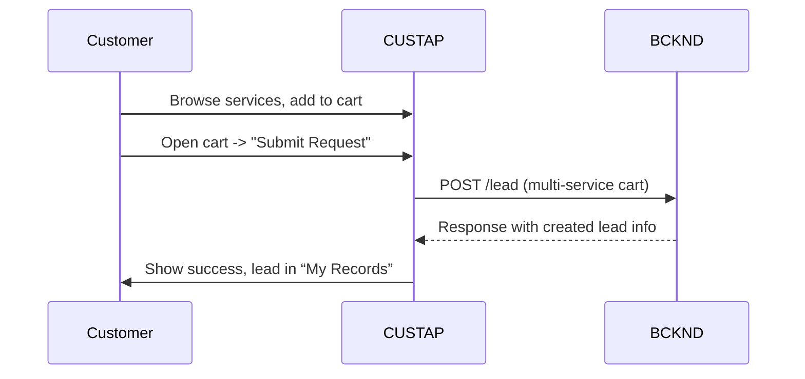
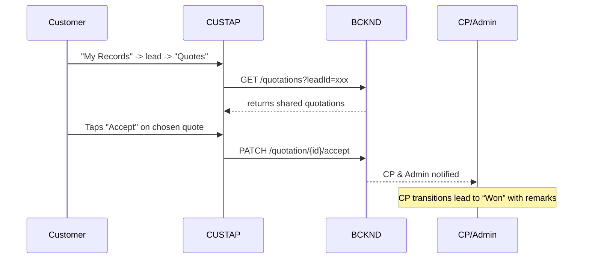
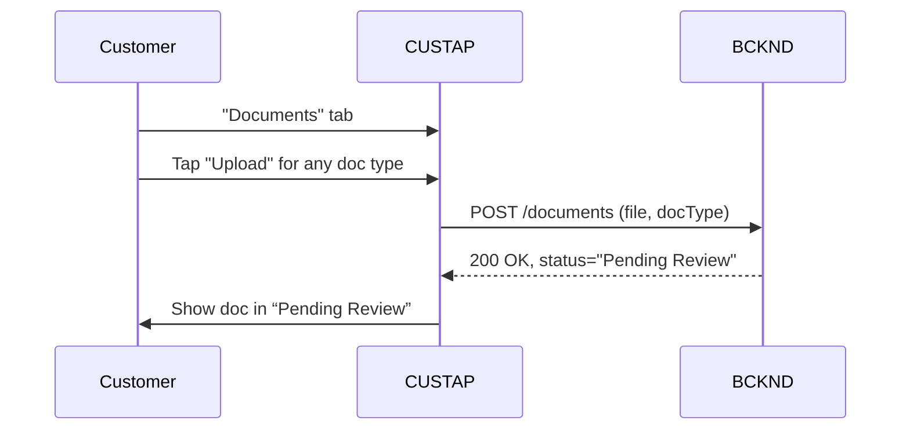
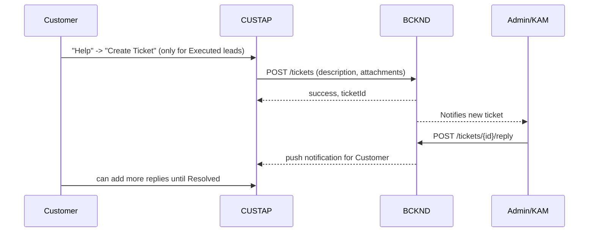

## L3-WF-CUSTAP: Workflow Details for CUSTAP: A mobile app enabling customers to request multiple solar services, manage personal KYC documents, view and accept/reject quotations, and create support tickets once projects are executed.

--------------------------------------------------------------------------------
NOTE ON DOCUMENT REVISION:

• All prior references to a separate “Customer Accepted” lead status are hereby removed, and we are standardizing the approach that once a Customer taps “Accept,” the system notifies CP/Admin, but does not automatically change the lead status. CP or Admin must manually set it to “Won,” consistent with the revised L1 flow. Any mention of “Customer Accepted” in older L1-Overview or L1-WF documents should be considered deprecated.

• The multi-service cart is introduced here for Customer convenience. While L1 did not explicitly call it a “cart,” it referenced a service catalog for lead creation. This L3 clarifies that multiple services can be combined into one lead at the time of checkout. For the current scale, CP or Admin must handle any complexities (e.g., single-service Quotation Wizard) by generating quotes that map appropriately within the lead.

• Notification preference toggles described in some earlier drafts are removed. All push notifications are delivered automatically.

• We clarify the OTP lockout policy applies to Customers as well, matching the Channel Partner’s approach in L1-WF: after five incorrect OTP attempts, further requests are locked for 15 minutes.

• We confirm that support tickets are restricted to “Executed” leads only, aligning with the L1 persona’s reference (Raise support tickets for executed projects).

• We have added short introductions ahead of certain subsections to improve readability and context, as recommended.

--------------------------------------------------------------------------------

## 1. Introduction

This section explains how the Customer Mobile App (CUSTAP) works within the Solarium Green Energy solution, enabling end users to discover and request solar services, manage their personal documentation, accept or reject quotations, and receive post-installation support.  

In this final approach, there is no “Customer Accepted” status. After a quotation acceptance by the Customer, the lead remains in its pre-Won stage until a CP or Admin manually updates it to “Won.” This simpler manual workflow suits our current scale and avoids automatic misalignment in funnel metrics.

--------------------------------------------------------------------------------
## 2. Installation and Authentication Workflow

This section describes how customers install the mobile application, register or log in using OTP-based authentication, and how session tokens manage their access. It also clarifies the lockout policy for multiple failed OTP attempts, aligning it with the new L1 clarification that the same lockout applies to both CP and Customer.

### 2.1 Downloading and Installing
Before initiating registration or login, customers must obtain the official app through the mobile app stores, as described below.  
• The customer searches for “Solarium Green Energy” in the Google Play Store or Apple App Store.  
• Downloads and installs the mobile application onto their device.  
• Launches the app to proceed with registration or login.

### 2.2 Registration and First-Time Login
• The customer enters their phone number and taps "Get OTP."  
• A 6-digit OTP is sent via SMS (valid for 2 minutes, with up to 5 attempts).  
• After 5 incorrect OTP attempts, the system locks further OTP requests for 15 minutes, the same as for CPs in L1-WF.  
• If the phone number is new, upon successful OTP verification, the app prompts for profile data (Name*, Address*, State*, PIN*, optional Email).  
• Once submitted, the user lands on the main “Services” screen.

### 2.3 Returning Customer Login
This subsection explains how existing customers authenticate again using the same OTP-based flow, ensuring secure re-entry into the app.  
• A returning customer enters their registered phone number, taps "Get OTP," and enters the OTP.  
• Upon correct OTP validation, the system grants access to the customer’s session.

### 2.4 Session Token Expiration
This subsection highlights how session tokens are managed and when they expire due to inactivity.  
• Tokens auto-refresh daily, maintaining a continuous session.  
• A hard logout occurs after 30 consecutive days of inactivity.  
• If logged out, the customer must again provide phone + OTP to regain access.

--------------------------------------------------------------------------------
## 3. Offline Handling

This section summarizes the app’s behavior when network connectivity is unavailable, specifying which operations are allowed offline.

• The Customer App supports viewing previously loaded data (services list, leads, quotations, etc.) while offline.  
• Any write or update attempt (submitting a new service request, uploading a document) is disallowed offline and prompts an error.  
• No queued offline actions are retained, reflecting a deliberate choice at the current scale. Future enhancements may revisit queued offline writes if needed.

--------------------------------------------------------------------------------
## 4. Main Navigation

This section describes the primary layout of the CUSTAP interface, including bottom tabs and top bar controls, to guide users through services, documents, lead records, and help features.

The bottom navigation layout and top bar controls form the core of the CUSTAP user interface. Each tab focuses on a key part of the user journey.

1. **Services**  
   – Displays the catalog of solar-related offerings. Allows the user to add multiple services to a virtual cart.

2. **Documents**  
   – Dedicated space for the customer’s personal KYC uploads. Each KYC doc is listed with status (Pending Review, Approved, or Rejected).

3. **My Records**  
   – A list of all Leads (service requests) the user has previously submitted, showing the respective statuses, any associated quotations, and other lead details.

4. **Help**  
   – Central help screen, including any support tickets for “Executed” leads, plus a helpline number and FAQs.

**Top Bar**  
• **Sync Icon** → manually triggers a data sync with the server.  
• **Notifications Bell** → shows recent push notifications.  
• **Profile Icon** → navigates to account details and settings.

--------------------------------------------------------------------------------
## 5. Service Request Workflow (Multi-Service Cart)

This section explains how the Customer can select multiple services in a single lead submission. While L1 did not explicitly mention a "cart," it did reference a service catalog for lead creation. Here, we extend that approach to allow multiple services per request, acknowledging that the CP’s Quotation Wizard may still handle one consolidated configuration or multiple line items at the CP’s discretion.

### 5.1 Browsing and Adding Services
This subsection introduces how a user navigates the service catalog and places items into the cart.  
• From the “Services” screen, the user views a grid or list of available solar installations, upgrades, or related offerings.  
• Tapping “Add to Cart” on any item places it into a temporary cart.  
• A cart icon (usually a floating button) reflects the number of services selected.

### 5.2 Checkout
This subsection details the submission process once the user has finalized their selection. It also covers the server’s response if any error or validation occurs.  
• The user taps the cart icon to see all selected services.  
• They can remove any unwanted items before finalizing.  
• Tapping “Submit Request” sends the entire cart as a single lead creation request to the backend (status = “New Lead,” origin = Customer).  
• A success message displays, and the new lead immediately appears in “My Records.”  
If the server returns an error (e.g., validation failure, server unavailable), the user sees a clear error message and may retry submission or contact support.

### 5.3 Post-Submission
This subsection summarizes what happens after the new lead is created, including how CP is notified and how the user can monitor progress.  
• The system notifies any assigned CP (once determined) that a new lead has been created.  
• The user can monitor lead status from the “My Records” tab.  
• Any subsequent quotations, status changes, or communications appear attached to this lead.

--------------------------------------------------------------------------------
## 6. Quotation Viewing and Acceptance Workflow

This section explains how the Customer reviews quotations, chooses to accept or reject them, and how acceptance triggers a manual “Won” update by CP or Admin at our current scale.

In L1-WF, once a quotation is shared with the Customer, the Customer may accept or reject it. After acceptance, no automatic status change occurs; the CP or Admin must update the lead to “Won” using the accepted Quotation ID.

### 6.1 Accessing Quotations
• The customer goes to “My Records” → selects a Lead → taps “Quotes.”  
• All quotations marked “sharedWithCustomer = Yes” are listed, with a PDF preview or download link.

### 6.2 Accepting or Rejecting Quotations
If multiple quotations exist, the user can view each to compare details before deciding.  
• The customer may tap either “Accept” or “Reject” per quotation.  
• When the customer taps “Accept,” the system notifies the CP/Admin. The lead remains unchanged until CP/Admin manually sets it to “Won.”  
• Only one quotation can be accepted per lead; accepting one effectively rejects or supersedes all others.  
If CP/Admin has already retracted the quote or changed the lead to a terminal state, the system must show an error if the user tries to accept an outdated quotation.

### 6.3 If All Quotations Are Rejected
• If the user rejects all quotations, the lead remains at its current status (e.g., “In Discussion”). The CP may generate new quotes or close the lead if no further interest remains.

### 6.4 Notifications & Finalization
• CP and Admin receive push notifications whenever a user accepts or rejects a quotation.  
• To finalize the sale, the CP updates the lead to “Won,” referencing the accepted quote and remarks, as required by L1-WF.  

--------------------------------------------------------------------------------
## 7. KYC and Document Management Workflow

Customers may only upload personal KYC documents here. Site- or lead-specific uploads remain under CP control, matching the L1 definition of responsibilities.

### 7.1 KYC Checklist
• Accessed from the “Documents” tab in bottom navigation.  
• The system expects up to seven possible documents: Income Proof, Light Bill (latest), Cancelled Cheque, Aadhaar Card, PAN Card, Passport-size Photo, and Other.

### 7.2 Uploading Documents
• Tapping “Upload” on any KYC type launches the device’s file picker (camera, gallery, file manager).  
• Files must be ≤10 MB and in PDF/JPG/PNG format.  
• After successful upload, the document status becomes “Pending Review.”  
If the file exceeds 10 MB or uses an unsupported format, the user sees an error message (e.g., “File size exceeds 10 MB limit” or “Unsupported file type”). The system rejects the upload, and the user may retry with a valid file.

### 7.3 Approved vs. Rejected & Re-Uploading
• If Admin/KAM approves, status → “Approved,” locking that doc from further replacement.  
• If “Rejected,” the user sees the reason provided; a new “Upload” button appears to resubmit.  
• If a document is still “Pending Review,” the user may also re-upload to correct any errors before Admin/KAM approval.  
No formal limit on re-uploads currently exists. For future releases, the organization may introduce versioning or maximum attempts after repeated rejections.

--------------------------------------------------------------------------------
## 8. Support Ticket Workflow

This section covers how customers raise support issues but only after a project is completed, consistent with L1’s “Raise support tickets for executed projects.”

In accordance with L1-WF for the Customer persona, tickets can be raised only for leads that have reached “Executed” status.

### 8.1 Creating a New Ticket
This subsection explains the steps for opening a new ticket once a lead is executed.  
• Once a Lead has status = “Executed,” the user sees a “Create Ticket” option in the “Help” tab.  
• They select the executed lead, provide a subject/description, and optionally attach files.  
• If a lead is not “Executed,” the app disallows ticket creation, displaying a brief error message.

### 8.2 Conversation & Responses
Here we describe how the conversation proceeds after the ticket is opened.  
• The user and Admin/KAM exchange messages in a chronological thread.  
• Attachments are supported up to 10 MB (PDF, JPG, PNG).  
• Users receive push notifications for staff replies; staff sees them in the web portal.

### 8.3 Resolution & Closure
This subsection clarifies how the ticket is resolved and if the user can re-open.  
• Staff marks the ticket “Resolved” once the issue is addressed.  
• The user can confirm closure or request further follow-up.  
• Tickets remain viewable in the user’s “Help” history, even after closure.

--------------------------------------------------------------------------------
## 9. Notifications

This section describes how the Customer is automatically notified of major events: new quotes, lead status changes, KYC approvals, and support ticket replies. No user-driven preference toggles are provided at this time.

### 9.1 Push Notifications
• Delivery is automatic for significant events: new quotations, updates to lead statuses, KYC doc review results, and ticket responses.  
•   
All notification categories are enabled by default with no user-facing toggles, aligning with the current product direction and scale.

### 9.2 Notification History
• The top-bar “bell” icon opens a scrollable log of recent notifications.  
• This log provides a simple one-stop view of all recent communication from CP, Admin, or system events.

--------------------------------------------------------------------------------
## 10. Profile and Settings

This section covers how customers update personal info or log out of the system. For the current scale, advanced profile features remain minimal.

### 10.1 Editing Profile
• Tapping the profile icon opens “My Profile,” showing name, email, address, and PIN code (all editable).  
• The phone number is read-only.

### 10.2 Logout
• Immediately invalidates the current JWT session.  
• The user logs in again via phone + OTP to re-enter the app.

--------------------------------------------------------------------------------
## 11. Mermaid Diagrams

Below are sequence diagrams showing the multi-service cart flow, accepting/rejecting quotations ( with no separate “Customer Accepted” status), KYC uploads, and ticket creation restricted to “Executed” leads.

### 11.1 Service Request Creation (Multi-Service Cart)

### 11.2 Quotation Acceptance / “Won” Update

### 11.3 KYC Document Upload

### 11.4 Support Ticket (Executed Leads Only)

Finally, if the lead or quotation changes unexpectedly (e.g., the CP sets the lead to a terminal state while the user is mid-accept), the system will display an error upon the user’s acceptance attempt. This ensures basic concurrency handling without overcomplicating the current solution scale.

--------------------------------------------------------------------------------
End of Revised L3-WF-CUSTAP Document (with marked changes)