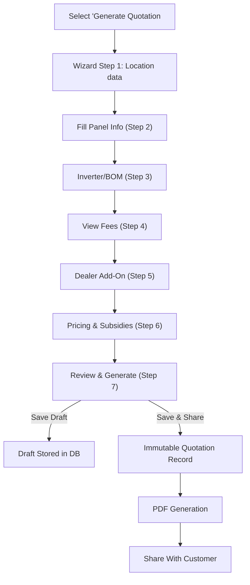
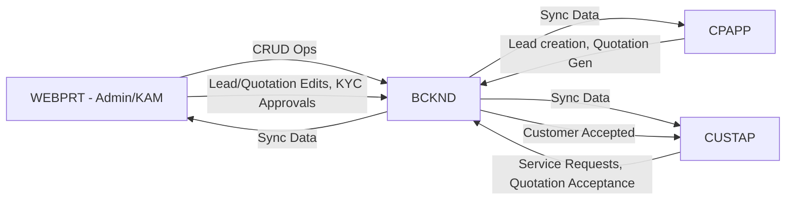

## L3-WF-WEBPRT: Workflow Details for WEBPRT: The Web Portal for Solarium Admins and Key Account Managers

This revised version includes clarifications about:
- The newly introduced “Customer Accepted” lead status.
- Partial quotation saving for Admin/KAM (not for CP).
- The requirement that CPs with non-terminal leads must be reassigned before deactivation.
- Concurrency nuances and “Last Write Wins” implications.
- Brief introductory paragraphs for each sub-section, per client guidelines.
- The need to align L1-WF with “Customer Accepted” status to avoid contradictions.

Wherever text has been newly inserted, it is wrapped with <add> ... </add>; updates to existing phrases are marked with <edit> ... </edit>; and any removals would be marked <delete>...</delete> (though no major deletions were needed here). Please note that, at the current scale, we focus on pragmatic solutions without overengineering or advanced conflict resolution mechanisms.

 

---

## 1. Introduction

This document provides a detailed view of the workflows in the WEBPRT component (the Solarium Green Energy web-based interface). It consolidates Admin and Key Account Manager (KAM) functionalities, including user login, managing Channel Partners (CPs), handling leads, generating quotations, and overseeing commissions. It incorporates the client clarifications on partial quotation wizard saving, concurrency, deactivating CPs, CSV import rules, the newly introduced “Customer Accepted” lead status, and more.

This version also emphasizes that “Customer Accepted” is a legitimate status bridging the gap between “Physical Meeting Assigned” and “Won.” However, the L1-WF Document currently omits “Customer Accepted,” so the L1-WF must be updated to maintain consistency. In addition, partial-save functionality for quotations applies strictly to Admin/KAM in the WEBPRT, not to CPAPP.

 

---

## 2. Common Web Portal Features

### 2.1 Authentication & Session Management

This sub-section outlines how user sessions are created, managed, and timed out for Admin/KAM on the web portal, with a 30-minute inactivity limit. It also highlights partial-save interactions concerning session policy.

- WEBPRT enforces secure authentication against the BCKND’s JWT-based system.  
- Users (Admin/KAM) log in with email + password.  
- On successful login, a session token is set in secure storage.  
- Session Timeout:
  - Automatic logout after 30 minutes of inactivity (client clarification #5).  
  - User must re-authenticate to regain access.  
- Password recovery supported via “Forgot Password” link, which triggers an email-based reset.  
  Upon clicking the link, users must provide a registered email. If the email is valid, the system sends a reset token (valid for ~24 hours). Once the user follows the link in the email, they can enter a new password. Expired or invalid tokens yield an error message, prompting the user to request a fresh reset link.

Note: This session timeout policy (30 mins inactivity) differs from CPAPP’s longer auto-refresh cycle; they are intentionally separate for web vs mobile roles.

### 2.2 Navigation Layout

No changes.

### 2.3 Concurrency & Locking

This sub-section clarifies how WEBPRT handles simultaneous edits by multiple Admin/KAM, given the current scale of ~400 to ~600 concurrent users. It also addresses “Last Write Wins.”

- Concurrency model is “Last Write Wins” (client clarification #3).  
- If multiple Admin/KAM edit the same entity simultaneously, the most recent `Save` overwrites prior changes.  
- All changes are logged in an audit trail (timestamp + user ID).  
While no advanced conflict resolution or user-facing warnings are currently enforced, the system’s audit trail helps trace overwrites. Future enhancements may include lightweight optimistic locking if concurrency challenges grow.

### 2.4 Deactivating Channel Partners

This sub-section covers newly clarified rules around CP deactivation.

- WEBPRT restricts channel partner deactivation if they have assigned leads (client clarification #4).  
- If non-terminal (active) leads remain, the Admin or KAM must manually reassign or close them before deactivation is allowed. Terminal (Executed) leads do not block deactivation.  
- Once deactivated, the CP cannot log in, but their historical data remains for reporting.  
Note: Terminal (Executed) leads may remain historically linked to the CP without blocking deactivation if the system deems them fully closed. Non-terminal leads must be reassigned first.

 

---

## 3. Admin Workflows

This section details how Administrators log in, manage dashboards, handle CPs, leads, customers, quotations, commissions, and more. Each sub-section provides the context and step-by-step processes.

### 3.1 Admin Login & Landing

This sub-section explains the Admin’s entry point into the system and default landing page.

1. Admin navigates to WEBPRT URL and enters email + password.  
2. On successful authentication, Admin lands on the Dashboard, displaying a top-level sales funnel and key metrics.  
3. Session times out after 30 minutes of inactivity.

### 3.2 Admin Dashboard & Filters

Admins see a company-wide funnel. Newly introduced “Customer Accepted” status is included in the funnel here, though it is not yet in L1-WF. That mismatch must be addressed in L1 soon.

1. Dashboard shows funnel stages for all leads: (New → In Discussion → Physical Meeting Assigned → Customer Accepted → Won → Pending at Solarium → Under Execution → Executed).  
2. Time-based filters: (Today, Last 7 Days, etc.).  
3. Geographic filters: e.g., State-level breakdown.  
4. Admin can drill into any stage to see the filtered leads list.  
5. When a lead moves to “Customer Accepted,” it indicates the quotation acceptance was recorded from the customer side. The Admin may confirm details and manually transition the lead to “Won” once they verify the correct quotation reference.

### 3.3 Manage Channel Partners

This covers managing CP access, approvals, and new constraints on CP deactivation if non-terminal leads still exist.

1. **Access**: Admin clicks “Channel Partners” in sidebar.  
2. **Approve New CP**: For pending registrations, Admin reviews details → clicks “Activate.” System sends “Approved” SMS to CP.  
3. **View CP Profile**: Admin can see Basic Info, Assigned Leads, Quotations, Commission History, Timeline.  
4. **Deactivate/Reactivate**: Must ensure no active (non-terminal) leads remain assigned to CP if deactivating.
5. **Bulk KAM Assignment**: Admin selects multiple CPs → clicks “Assign KAM” → chooses KAM from dropdown.

### 3.4 Manage Key Account Managers

1. **Access**: “KAMs” in sidebar. Displays list of all KAMs.  
2. **Add KAM**: Admin clicks “Add New KAM,” enters (Name, Email, Phone, Assign CPs, etc.).  
3. **Edit KAM**: Updated fields such as assigned CPs, region coverage.  
4. **Deactivate KAM**: The KAM user can no longer log in; CP reassignments may be needed.

### 3.5 Manage Customers

Admin can view and update customer profiles, along with managing KYC documents across the system’s mandated 7-year retention policy.

1. **Access**: “Customers” in sidebar.  
2. **List**: Shows all customers, phone-based unique IDs, lead count.  
3. **KYC Approvals**: Admin reviews each KYC document → Approve or Reject with reason.  
4. **Customer Profile**: View basic info, leads, KYC checklist, quotations, support tickets.  
5. KYC Document Versioning: When a new file is uploaded, the system discards the old file from the main UI but archives it for compliance, storing it securely for at least 7 years. Historical versions are not shown by default.

### 3.6 Manage Leads

“Customer Accepted” is introduced here, bridging Physical Meeting Assigned and Won. CSV import rules and bulk operations are also included.

1. **Access**: “Leads Management” in sidebar.  
2. **Lead List**: Filter by (status, assigned CP, date range, etc.).  
3. **View Lead Detail**: Contains Info, Status, Quotations, Docs, Timeline.  
4. **Create Lead**: Admin clicks “Add New Lead” → Fill (customer data, assigned CP, initial status, follow-up date).  
5. **Reassign Lead**: Admin clicks “Reassign,” chooses new CP. System notifies both old & new CP.  
6. **Status Override**: Admin can force status outside normal matrix, logging an override reason.  
7. **Bulk Operations**:  
   - (Reassign, export to CSV, or force status) across selected leads.  
   - CSV Import is all-or-nothing (client clarification #6). Upon failure, the system provides a validation report indicating which rows or fields caused the error, so users can correct and re-import.

8. Mandatory Quotation Reference for “Won”: If Admin sets lead status to “Won,” they must specify a valid Quotation Reference Number, ensuring the correct quote is tied to the lead’s conversion.  
9. “Customer Accepted” Handling: Leads automatically transition to “Customer Accepted” status upon confirmed acceptance in the Customer App. Admin may then verify the acceptance and finalize the lead to “Won.”

### 3.7 Quotation Management

This section elucidates partial-save mechanics for Admin/KAM (not CP) and reaffirms final PDF immutability once the quote is completed.

1. **Access**: “Quotation Management” in sidebar.  
2. **List**: Displays all quotations. Filters by date, CP, capacity, share flag, etc.  
3. **View Quotation**: Admin sees configuration details. A “Share with Customer” toggle is available if the quotation is valid.  
4. **Generate Quotation** (Partial Save Supported):  
   - Admin selects a lead → enters 7-step wizard (Location, Panels, Inverter/BOM, Fees, Dealer Add-On, Pricing & Subsidy, Review & Generate).  
   - The wizard permits partial draft save for 24 hours (client clarification #1).  
   - Note: This partial-save feature is only for Admin/KAM. CPAPP does not currently support drafting or resuming partial quotations.  
   - If the session times out or the Admin logs out, they can resume the previously saved draft within 24 hours by accessing the “Drafts” or “Quotation Management” list, which displays incomplete records.  
   - If any master data (e.g., panel or fee structure) changes occur during the draft period, the system prompts the user to confirm updated pricing before finalizing the quote, preventing stale-cost PDFs.
   - Once fully completed, an immutable PDF is generated.  
   - Admin can immediately “Share” with the customer or keep it for internal use.

5. **Error Handling for Partial Saves**: If a server validation or network failure disrupts saving, the user sees an alert indicating the partial save did not persist. They can retry saving or discard changes. All partial save attempts are time-stamped.

### 3.8 Commission & Payouts

1. **Access**: “Commission & Payouts” in sidebar.  
2. **Tabs**: (Pending, Approved, Paid).  
3. **Approve Commission**: Admin sets the commission amount (defaults to calculated), clicks “Approve.”  
4. **Pay Commission**: Admin enters UTR, date, method → marks it “Paid.” Single payment only.  
5. **Reports**: Admin can export commission data (CSV or PDF) or run advanced filters.

### 3.9 Quotation Master Data Management

This sub-section deals with administering core product data (panels, inverters, fees, etc.). Only Admin can update these values, which apply immediately to new or resumed quotations.

1. **Access**: “Quotation Master Data” in sidebar for Panels, Inverters, Fees, etc.  
2. **Edit**: Admin updates pricing, modifies product availability.  
3. **Immediate Apply**: Changes go live as soon as Admin saves (client clarification #8).  
4. **No KAM Edits**: KAMs cannot alter master data (client clarification #2).  
5. **Audit**: All changes logged with timestamps for reference.  
6. Interaction with Draft Quotations: If a partial quote references items that are changed or deactivated, the system prompts the user to reconcile those differences upon resuming the draft.

### 3.10 Global Settings & Audit

This section summarizes how Admin configures system-wide parameters and how changes are tracked.

1. **Access**: “Global Settings” in sidebar.  
2. **Fields**: Contains inflation percentage, default add-on ranges, and other system-wide parameters.  
3. **Audit Trail for Changes**: The system records old/new values with timestamps (client clarification #10).  
4. **Session Timeout**: Ensured at 30 minutes of idle time for Admin sessions.

### 3.11 Support Ticket Management

1. **Access**: “Support” in sidebar.  
2. **List**: Filter by (open/closed/all), CP, customer, date range.  
3. **View Thread**: All messages, including attachments.  
4. **Respond**: Admin can add text or file attachments, quickly update the ticket’s status.  
5. **Close Ticket**: Provide closure notes; system notifies the customer or CP.

### 3.12 Reporting & Analytics

Here, Admins view top-level or granular insights on leads, quotations, commissions, or funnel progression. They can export data and identify bottlenecks or trends.

No changes in introduction. Steps remain.

### 3.13 Admin Profile & Notifications

This sub-section covers accessing the Admin’s account settings and notifications about system events.

No changes.

 

---

## 4. Key Account Manager (KAM) Workflows

The following outlines KAM-specific login, dashboard, CP management (assigned only), lead handling, limited quotation creation, and read-only commission view.

### 4.1 KAM Login & Landing

This sub-section addresses how KAMs authenticate and see their territory-based summary.

1. KAM enters email + password on the WEBPRT login screen.  
2. If valid, lands on KAM Dashboard with territory-specific funnel data.  
3. Session times out after 30 minutes of inactivity.

### 4.2 KAM Dashboard & Filters

1. The default funnel for assigned CPs includes the status sequence: (New → In Discussion → Physical Meeting Assigned → Customer Accepted → Won → Pending at Solarium → Under Execution → Executed).  
2. Time-based or CP-based filters.  
3. KAM can export funnel data in CSV or PNG.  
4. Clicking a funnel stage leads to the filtered lead list.

### 4.3 Channel Partner Management

KAM can only view CPs assigned to them. KAM cannot change CP activation status but can reassign leads within their CP group.

1. **Access**: “Channel Partners” in main navigation.  
2. **View CPs**: Listings only for CPs assigned to the KAM.  
3. **Profile View**: Basic Info, Assigned Leads, Quotations, Commission History (read-only), Timeline.  
4. **No CP Activation/Deactivation**: KAM cannot activate or deactivate CP accounts.  
5. **Bulk Reassign**: If allowed per updated RBAC, KAM can assign leads among their existing CPs only. In some versions, KAM might be restricted from bulk operations; confirm final RBAC if uncertain.

### 4.4 Customer Management

1. **Access**: “Customers” in main navigation.  
2. **Filter**: Only displays customers belonging to the KAM’s CPs.  
3. **View Customer**: Basic info, leads, quotations, KYC docs.  
4. **Approve/Reject KYC**: KAM can mark a KYC doc as “Approved” or “Rejected” with reasons.

### 4.5 Lead Management

This sub-section explains how KAMs manage leads, override statuses, or reassign them among their assigned CPs. “Customer Accepted” also appears in their funnel.

1. **List**: KAM sees leads assigned to their CPs, can filter by status, date, etc.  
2. **View Lead**: Similar tab structure (Info, Status, Quotations, Docs, Timeline).  
3. **Create Lead**: KAM can add new leads, auto-assigning them to a CP in the KAM’s territory.  
4. **Reassign Lead**: KAM can move leads only within CPs they manage.  
5. **Status Override**: KAM can forcibly set a lead to any status with an override reason.  
6. “Customer Accepted” → “Won”: If a lead is at “Customer Accepted,” the KAM may confirm the chosen quotation reference before setting the lead to “Won.” This ensures the correct quote is locked in for subsequent commission calculations.

### 4.6 Quotation Management

1. **Access**: “Quotation Management.”  
2. **List**: KAM sees quotations from their CPs.  
3. **Generate Quotation** (Partial Save Supported):  
   - 7-step wizard identical to Admin’s (Location → Panels → Inverter/BOM → Fees → Add-On → Pricing & Subsidy → Review).  
   - Partial draft can be saved for 24 hours.  
   - Finalizing creates an immutable record.  
4. **Share Quotation**: KAM can toggle “Shared with Customer” if the quote is valid.

### 4.7 Commission & Payouts (Read-Only)

No changes.

### 4.8 Support Ticket Management

No changes.

### 4.9 KAM Profile & Notifications

No changes.

 

---

## 5. Sample Mermaid Diagrams

### 5.1 Admin Quotation Wizard Flow

Below is a simplified view demonstrating how an Admin (or KAM) proceeds through the 7-step wizard, with an option to save progress as a draft.

- “Save Draft” is stored for up to 24 hours (client clarification #1). If user leaves wizard without completing or saving, partial data is lost.
- If master data changes while a draft is active, the system revalidates on wizard resume, prompting the Admin/KAM to accept updated pricing or fix invalid items before finalizing.

### 5.2 WEBPRT Integration Overview (Additional Diagram)

This diagram shows how Admin/KAM actions in WEBPRT connect through BCKND to CPAPP and CUSTAP for real-time updates. When the customer accepts a quote via CUSTAP, the lead enters “Customer Accepted,” visible in WEBPRT funnels.

 

---

## 6. Integration Points

- **CPAPP**:  
  - Admin or KAM reassign leads that appear on CP’s mobile app.  
  - Quotations generated in WEBPRT can be visible to CP if “Shared.”  
  - Commissions awarded to CP are updated here.

- **CUSTAP**:  
  - When Admin/KAM (or CP) marks a quotation as “Shared,” the customer sees it in their mobile app.  
  - KYC docs approved in WEBPRT reflect as “Approved” on the customer’s end.  
  - If the customer chooses “Accept Quotation,” the lead automatically transitions to “Customer Accepted” in the system; then an Admin/KAM or CP can finalize it as “Won.”

- **BCKND**:  
  - All front-end calls go to backend REST endpoints for data persistence.  
  - Through the BCKND, the system logs concurrency changes, obtains new tokens for session maintenance, sends notifications, etc.

 

---

## 7. Key Points & Clarifications

1. **Partial Save in Quotation Wizard**: Allowed for up to 24 hours (client clarification #1). 
   Applies only to Admin/KAM in the web portal, not CPAPP.

2. **Master Data**: Only Admin modifies. KAM uses data “as is” (client clarification #2).  
3. **Concurrency**: “Last Write Wins” approach. All changes audited (client clarification #3).  
4. **Deactivating CP**: Must first remove or reassign non-terminal leads; CP is locked out once deactivated (client clarification #4).  
5. **Session Timeout**: 30-minute inactivity logout for web portal sessions (client clarification #5).  
6. **CSV Import**: All-or-nothing. Partial row acceptance is not supported (client clarification #6).  
7. **Commission Payment**: Single “Paid” action, no partial installments (client clarification #7).  
8. **Master Data Updates**: Immediate effect. No scheduled changes (client clarification #8).  
9. **KYC File Overwrites**: Previous versions are archived for 7-year retention, while the newest file is shown in the UI (client clarification #9).  
10. **Global Settings Audit**: System logs before/after values + timestamps (client clarification #10).  
11. “Customer Accepted” Status: Introduced to capture the interim state between Physical Meeting Assigned and Won when the customer formally approves a shared quotation.We acknowledge that L1-WF must be updated to include “Customer Accepted” for full consistency.

 

---

## 8. Conclusion

The WEBPRT component enables Solarium’s Admins and KAMs to manage leads, channel partners, master data, commissions, and tickets through a unified interface. These workflows detail how the user role dictates feature exposure, ensuring controlled privileges and accurate data flows. By adhering to the “Last Write Wins” concurrency model and a 30-minute session timeout, the system remains secure and coherent. The integrated partial save for quotations (limited to Admin/KAM only), immediate master data updates, and single-step commission payout collectively fulfill the specified business requirements without overcomplicating the solution.  

The introduction of “Customer Accepted” ensures a clearer distinction from “Won,” preventing premature status changes when a customer first approves a quotation. However, L1-WF must be updated to reflect this new step in the official lead status flow. Finally, clarifying the new CP deactivation prerequisite (no active leads) ensures consistency across Admin, KAM, CPAPP, and BCKND interactions.